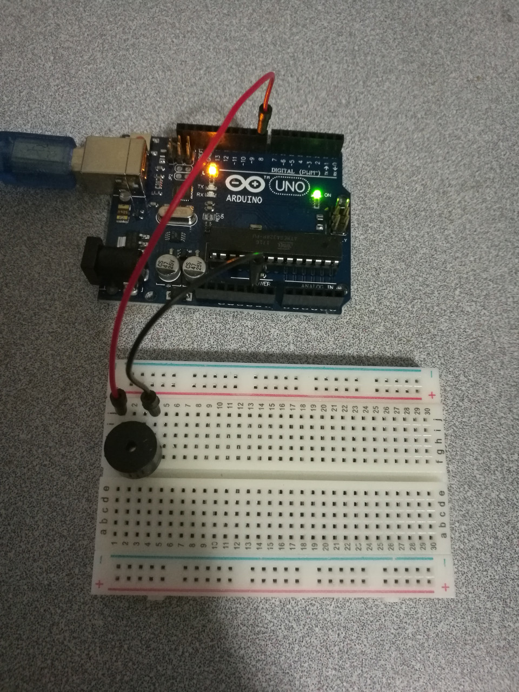

# Passive Buzzer


## Hardware Wiring


## Sketch
```
int buzzer=7;//set buzzer IO pin as 7
void setup()
{
  pinMode(buzzer,OUTPUT);//set pin 7 as mode OUTPUT
}
void loop()
{
  unsigned char i,j;//declare variables
  while(1)
  {
    for(i=0;i<80;i++)//output a buzz at frequency 1
    {
      digitalWrite(buzzer,HIGH);//HIGH - output a buzz
      delay(1);//Delay 1ms
      digitalWrite(buzzer,LOW);//LOW - no buzz
      delay(1);//Delay 1ms
    }
    for(i=0;i<100;i++)//output a buzz at frequency 2
    {
      digitalWrite(buzzer,HIGH);//HIGH - output a buzz
      delay(2);//Delay 2ms
      digitalWrite(buzzer,LOW);//LOW - no buzz
      delay(2);//Delay 2ms
    }
  }
}
```