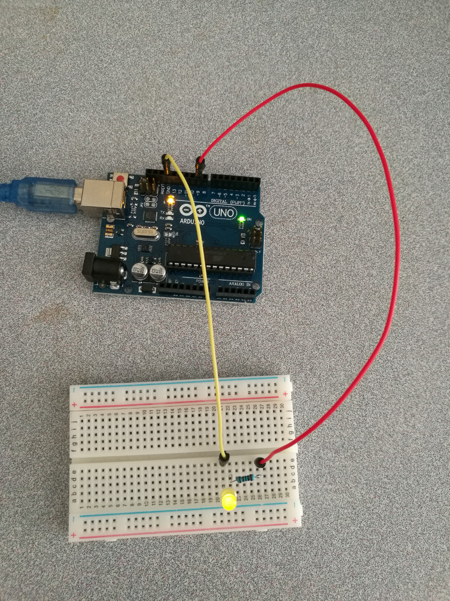

# LED PWM Fading

## Hardware Wiring


## Sketch
```
/*
 Fade

 This example shows how to fade an LED on pin 9
 using the analogWrite() function.

 This example code is in the public domain.
 */

int led = 9;           // the pin that the LED is attached to
int brightness = 0;    // how bright the LED is
int fadeAmount = 5;    // how many points to fade the LED by

// the setup routine runs once when you press reset:
void setup()  { 
  // declare pin 9 to be an output:
  pinMode(led, OUTPUT);
} 

// the loop routine runs over and over again forever:
void loop()  { 
  // set the brightness of pin 9:
  analogWrite(led, brightness);    

  // change the brightness for next time through the loop:
  brightness = brightness + fadeAmount;

  // reverse the direction of the fading at the ends of the fade: 
  if (brightness == 0 || brightness == 255) {
    fadeAmount = -fadeAmount ; 
  }     
  // wait for 30 milliseconds to see the dimming effect    
  delay(20);                            
}
```