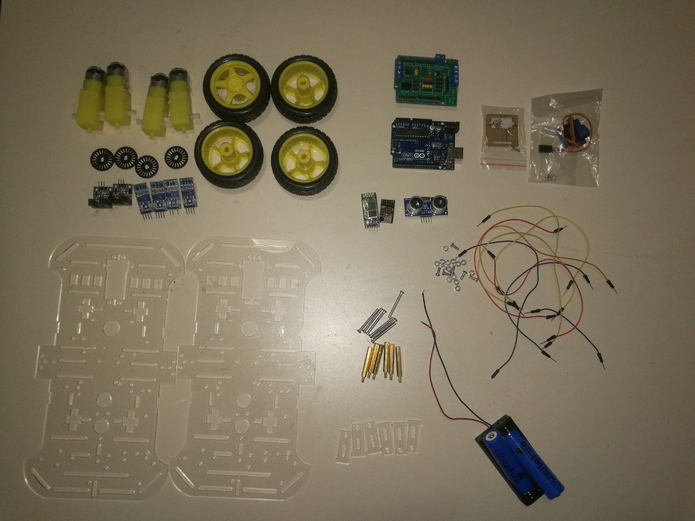

# 1.4 Race Car Chassis Model

Students who take our Arduino course on-site will be given a **FREE** full set of race car chassis model. Students are also welcome to puchase the kits from our website at [http://www.longervisionrobot.com/en-us/products/race-car-chassis](http://www.longervisionrobot.com/en-us/products/race-car-chassis). A full set of race car chassis model from [Longer Vision Robot](http://www.longervisionrobot.com) contains:

Item | No. of Pieces | Model | Features   
--------- | ------- | -------- | -------------
Acrylic plate | 
2
 | | 
Wheels | 
4
 | | 
DC Gear Motor | 
4
 | 
TB6612
 | 
DC 3.3V~12V
 
Speed ​​Encoder | 
2
 | |  
Speed Sensor | 
2
 | |  
Tracking Sensor | 
4
 | |  
Ultrasonic Sensor | 
1
 |  
HY-SRF04/HY-SRF05
 |  Working Range: 2cm~450cm
Wifi | 
1
 | 
ESP8266
 |  
Bluetooth | 
1
 | 
HC-06/ZS-040
 |  
Battery | 
2
 | 
18650
 | 3.7V
Cradle Head | 
1
 | |  
Screw & Nut | 
some
 | | 
Nylon Column | 
some
 | |  
Electrical Wire | 
some
 | |   

