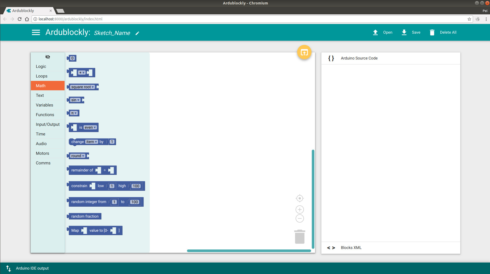

# Chapter 2 - Programming Grammar

In this chapter, we are going to talk about the programming grammar for Arduino, namely, AVR C, in detail. For younger students and amateurs, [Ardublockly](https://ardublockly.embeddedlog.com/) is strongly recommended, but will **NOT** be discussed in this course. The IDE of [Ardublockly](https://ardublockly.embeddedlog.com/) looks like:

