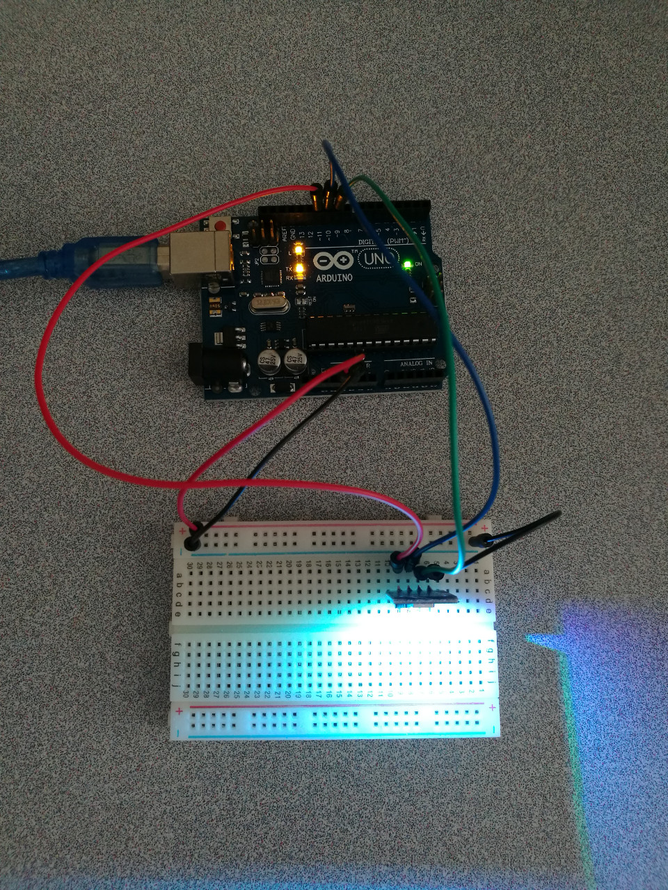

# 3.2 LED SMD RGB

* LED: light-emitting diode
* SMD: surface-mount device
* [SMD LED](https://en.wikipedia.org/wiki/SMD_LED_Module): An SMD LED Module (surface-mount device light-emitting diode module) is a type of LED module that uses surface-mount technology ([SMT](https://en.wikipedia.org/wiki/Surface-mount_technology)) to mount LED chips on printed circuit boards ([PCB](https://en.wikipedia.org/wiki/Printed_circuit_boards)).

## Hardware Wiring




## Sketch

The code can be found at [Examples_Arduino - sensor-kit-for-arduino - _008_LED_SMDRGB - _008_LED_SMDRGB.ino](https://github.com/LongerVisionRobot/Examples_Arduino/tree/master/sensor-kit-for-arduino/_008_LED_SMDRGB/_008_LED_SMDRGB.ino).
```
int redpin = 11;  //select the pin for the red LED
int bluepin =10;  // select the pin for the  blue LED
int greenpin =9;  // select the pin for the green LED

int val;

void setup() {
  pinMode(redpin, OUTPUT);
  pinMode(bluepin, OUTPUT);
  pinMode(greenpin, OUTPUT);
  Serial.begin(9600);
}

void loop() 
{
  for(val=255; val>0; val--)
  {
    analogWrite(11, val);
    analogWrite(10, 255-val);
    analogWrite(9, 128-val);
    delay(1); 
  }
  for(val=0; val<255; val++)
  {
    analogWrite(11, val);
    analogWrite(10, 255-val);
    analogWrite(9, 128-val);
    delay(1); 
  }
  Serial.println(val, DEC);
}
```