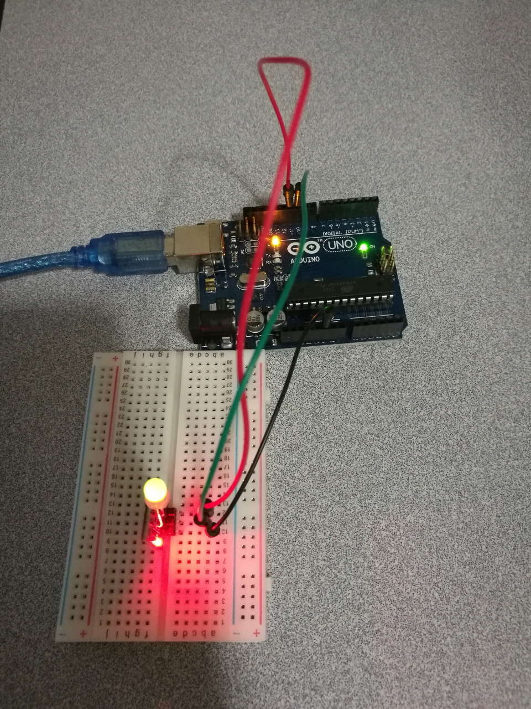

# 3.3 Mini LED Red Green

## Hardware Wiring




## Sketch

The code can be found at [Examples_Arduino - sensor-kit-for-arduino - _009_MiniLED_RG - _009_MiniLED_RG.ino](https://github.com/LongerVisionRobot/Examples_Arduino/tree/master/sensor-kit-for-arduino/_009_MiniLED_RG/_009_MiniLED_RG.ino).
```
 //Arduino test code:
int redpin = 11;  // select the pin for the red LED
int bluepin =10;  // select the pin for the blueLED
int val;
void setup() {
  pinMode(redpin, OUTPUT);
  pinMode(bluepin, OUTPUT);
  Serial.begin(9600);
}

void loop() 
{
for(val=255; val>0; val--)
  {
   analogWrite(11, val);
   analogWrite(10, 255-val);
   delay(15); 
  }
for(val=0; val<255; val++)
  {
   analogWrite(11, val);
   analogWrite(10, 255-val);
   delay(15); 
  }
 Serial.println(val, DEC);
}
```