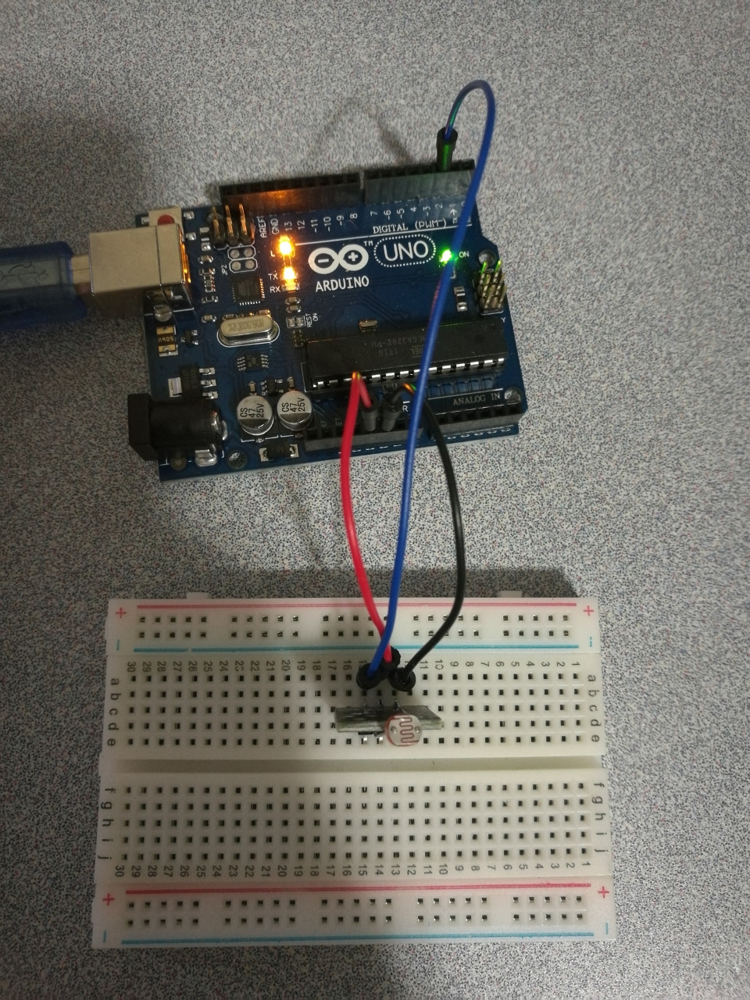

# 3.5 Photoresistor

## Example 1: 

## Hardware Wiring




## Sketch

The code can be found at [Examples_Arduino - sensor-kit-for-arduino - _015_PhotoResistor - _015_PhotoResistor.ino](https://github.com/LongerVisionRobot/Examples_Arduino/blob/master/sensor-kit-for-arduino/_015_PhotoResistor/_015_PhotoResistor.ino).
```
int sensorPin = 2;
int value = 0;
void setup() {
  pinMode(sensorPin, INPUT);
  Serial.begin(9600);
}
void loop() {
  value = analogRead(sensorPin);
  Serial.println(value, DEC);
  delay(50);
}
```


## Example 2: 

## Hardware Wiring


## Sketch

The code can be found at [Examples_Arduino - geek-workshop - studynotes - _005_Photoresistor - _005_Photoresistor.ino](https://github.com/LongerVisionRobot/Examples_Arduino/blob/master/geek-workshop/studynotes/_005_Photoresistor/_005_Photoresistor.ino).
```
int photocellPin = 2; //define variable photocellsh=2, where we read the voltage
int ledPin = 12;  //define variable ledPin=12, led voltage output
int val = 0;    //define variable val


void setup() { 
  pinMode(ledPin, OUTPUT);  // set ledPin as mode OUTPUT
} 

void loop() { 
  val = analogRead(photocellPin);    //read analog signal from pin 2
  Serial.print(val);
  if(val<=512){      //512=2.5V, if more sensitive is expected, increase 512; otherwise, decrease 512
    digitalWrite(ledPin, HIGH); //if val < 512(2.5V), led is light up.
  }
  else{
    digitalWrite(ledPin, LOW);
  }
}
```
