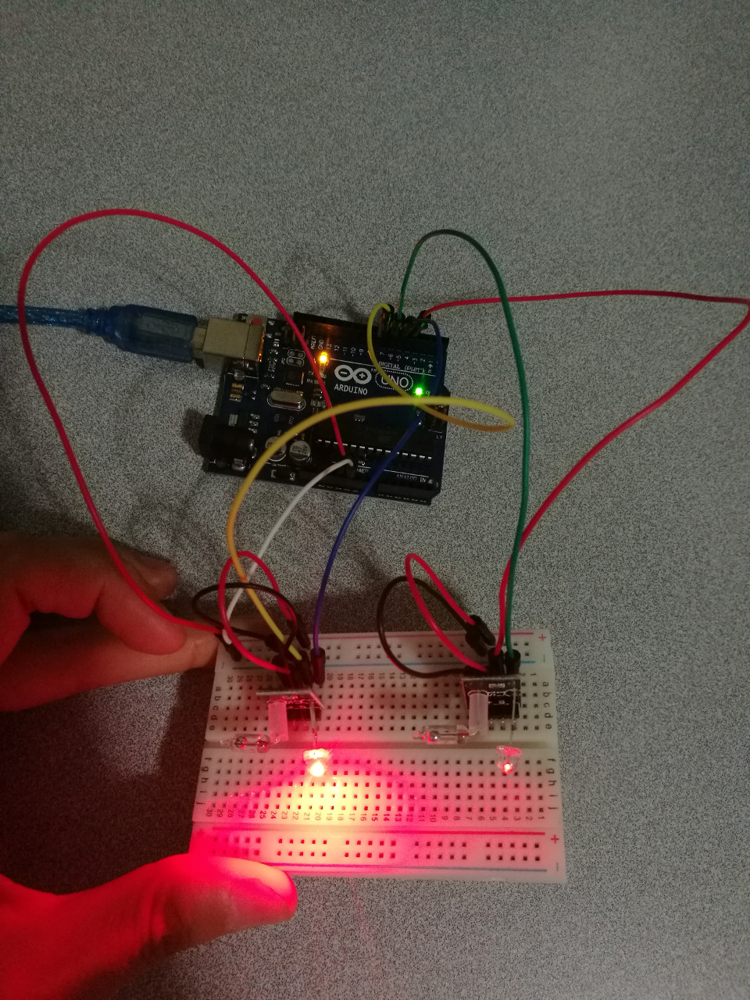

# 3.6 LED Light Cup

## Hardware Wiring




## Sketch

The code can be found at [Examples_Arduino - sensor-kit-for-arduino - _024_LED_LightCup - _024_LED_LightCup.ino](https://github.com/LongerVisionRobot/Examples_Arduino/blob/master/sensor-kit-for-arduino/_024_LED_LightCup/_024_LED_LightCup.ino).
```
int LedPinA = 5;
int LedPinB = 6;
int ButtonPinA = 7;
int ButtonPinB = 4;
int buttonStateA = 0; 
int buttonStateB = 0;
int brightness   = 0;

void setup() 
{
    pinMode(LedPinA, OUTPUT); 
    pinMode(LedPinB, OUTPUT);  
    pinMode(ButtonPinA, INPUT); 
    pinMode(ButtonPinB, INPUT);     
}

void loop() 
{
  buttonStateA = digitalRead(ButtonPinA);
  if (buttonStateA == HIGH && brightness != 255)
  { 
   brightness ++;
  } 

   buttonStateB = digitalRead(ButtonPinB);
   if (buttonStateB == HIGH && brightness != 0)
  { 
   brightness --;
  } 
    analogWrite(LedPinA, brightness);        // A turns dark slowly
    analogWrite(LedPinB, 255 - brightness);  // B turns bright slowly
    delay(25);
}

```