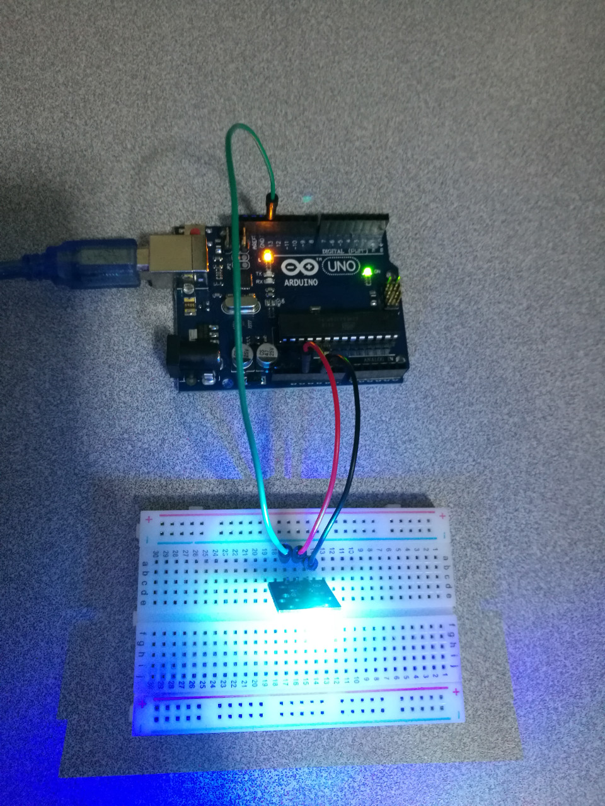

# 3.8 LED 7 Colors

## Hardware Wiring


## Sketch
```
/*
  Blink
  Turns on an LED on for two second, then off for two second, repeatedly.
 
  This example code is in the public domain.
 */

void setup() {                
  // initialize the digital pin as an output.
  // Pin 13 has an LED connected on most Arduino boards:
  pinMode(13, OUTPUT);     
}

void loop() {
  digitalWrite(13, HIGH);   // set the LED on
  delay(2000);              // wait for a second
  digitalWrite(13, LOW);    // set the LED off
  delay(2000);              // wait for a second
}
```