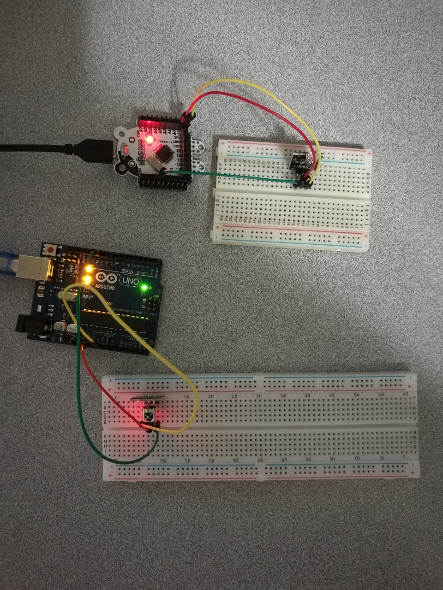

# 4.1 Infrared Controller

## Hardware Wiring


## Sketch
The code can be found at [Examples_Arduino - sensor-kit-for-arduino - _005_IRRemote_Emit - _005_IRRemote_Emit.ino](https://github.com/LongerVisionRobot/Examples_Arduino/blob/master/sensor-kit-for-arduino/_005_IRRemote_Emit/_005_IRRemote_Emit.ino) and [Examples_Arduino - sensor-kit-for-arduino - _005_IRRemote_Receive - _005_IRRemote_Receive.ino](https://github.com/LongerVisionRobot/Examples_Arduino/blob/master/sensor-kit-for-arduino/_005_IRRemote_Receive/_005_IRRemote_Receive.ino) .
### Emit
```
#include <IRremote.h>
IRsend irsend;
void setup()
{
  Serial.begin(9600);
}
void loop() {
  for (int i = 0; i < 50; i++) {
    irsend.sendSony(0xa90, 12); // Sony TV power code
    delay(40);
  }
}
```

### Receive
```
#include <IRremote.h>
int RECV_PIN = 11; //define input pin on Arduino
IRrecv irrecv(RECV_PIN);
decode_results results;
void setup()
{
  Serial.begin(9600);
  irrecv.enableIRIn(); // Start the receiver
}
void loop() {
  irrecv.decode(&results);
  Serial.println(results.value, HEX);
if (irrecv.decode(&results)) {
  Serial.println(results.value, HEX);
  irrecv.resume(); // Receive the next value
  }
}
```