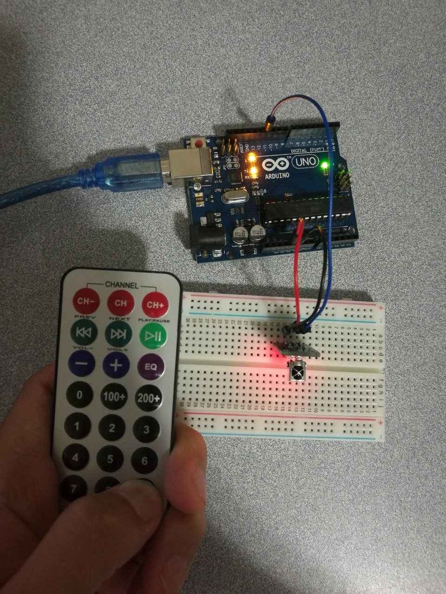

# 4.3 Infrared Controller

## Hardware Wiring


## Sketch
The code can be found at [Examples_Arduino - sensor-kit-for-arduino - _019_IRRemote_Controller - _019_IRRemote_Controller.ino](https://github.com/LongerVisionRobot/Examples_Arduino/blob/master/sensor-kit-for-arduino/_019_IRRemote_Controller/_019_IRRemote_Controller.ino).
```
#include <IRremote.h>
int RECV_PIN = 11; //define input pin on Arduino
IRrecv irrecv(RECV_PIN);
decode_results results;
void setup()
{
  Serial.begin(9600);
  irrecv.enableIRIn(); // Start the receiver
}
void loop() {
  if (irrecv.decode(&results)) {
    Serial.println(results.value, HEX);
    irrecv.resume(); // Receive the next value
  }
}
```