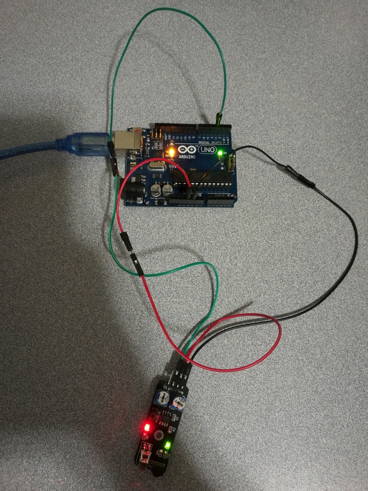

# 4.4 IR Obstacle Avoidance

## Hardware Wiring




## Sketch

The code can be found at [Examples_Arduino - sensor-kit-for-arduino - _028_IR_ObstacleAvoidance - _028_IR_ObstacleAvoidance.ino](https://github.com/LongerVisionRobot/Examples_Arduino/blob/master/sensor-kit-for-arduino/_028_IR_ObstacleAvoidance/_028_IR_ObstacleAvoidance.ino).
```
int Led=13;       // Define LED Pin
int buttonpin=3;  // Define the obstacle avoidance sensor's pin
int val;          // Define a variable val
void setup()
{
  pinMode(Led,OUTPUT);      // Define LED as output
  pinMode(buttonpin,INPUT); // Define obstacle avoidance sensor as input
  Serial.begin(9600);
}
void loop()
{
  val=digitalRead(buttonpin); // Assign digital pin 3 to val
  Serial.println(val);
  if(val==HIGH)   // if anything detected by obstacle avoidance sensor, LED starts flashing
  {
    digitalWrite(Led,HIGH);
  }
  else
  {
    digitalWrite(Led,LOW);
  }
}
```