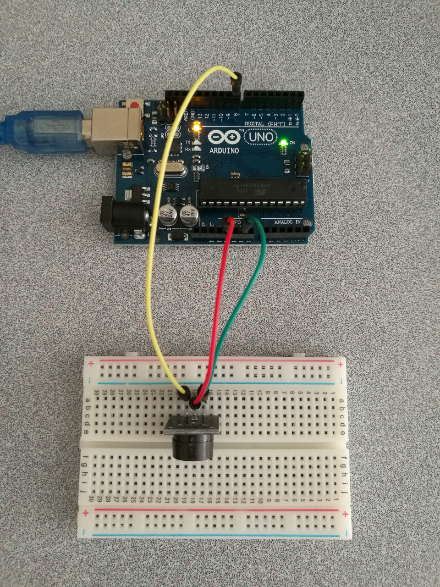

# 5.1 Passive Buzzer

## Hardware Wiring




## Sketch

The code can be found at [Examples_Arduino - sensor-kit-for-arduino - _006_PassiveBuzzer - _006_PassiveBuzzer.ino](https://github.com/LongerVisionRobot/Examples_Arduino/blob/master/sensor-kit-for-arduino/_006_PassiveBuzzer/_006_PassiveBuzzer.ino).
```
int buzzer=8; // Set buzzer IO pin, here 8
void setup()
{
  pinMode(buzzer,OUTPUT); // set buzzer pin as output
}
void loop()
{
  unsigned char i,j;  // Variable Definition
  while(1)
  {
    for(i=0;i<80;i++) // broadcast a noise at one frequency
    {
      digitalWrite(buzzer,HIGH);  // start buzzing
      delay(1); // delay 1ms
      digitalWrite(buzzer,LOW);   // stop buzzing
      delay(1); // delay 1ms
    }
    for(i=0;i<100;i++)  // broadcast a noise at the other frequency
    {
      digitalWrite(buzzer,HIGH);  // start buzzing
      delay(2); // delay 2ms
      digitalWrite(buzzer,LOW);   // stop buzzing
      delay(2); // delay 2ms
    }
  }
}
```