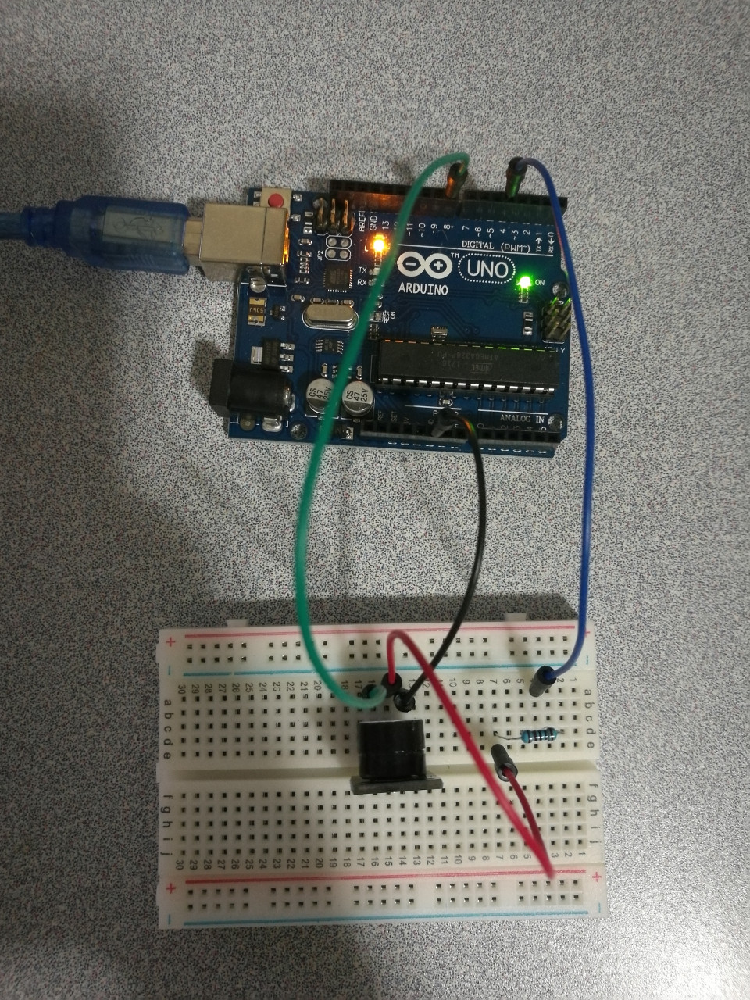

# 5.2 Active Buzzer

## Hardware Wiring




## Sketch

The code can be found at [Examples_Arduino - sensor-kit-for-arduino - _010_ActiveBuzzer - _010_ActiveBuzzer.ino](https://github.com/LongerVisionRobot/Examples_Arduino/blob/master/sensor-kit-for-arduino/_010_ActiveBuzzer/_010_ActiveBuzzer.ino).
```
int speakerPin = 8; // Define speaker's pin, here 8
int potPin = 4;     // Define the pin to control the adjustable resistor
int value = 0;
void setup() {
  pinMode(speakerPin, OUTPUT);
}
void loop() {
  value = analogRead(potPin); // Read the analog value of the adjustable resistor's pin
  digitalWrite(speakerPin, HIGH);
  delay(value); // adjust the buzzing time
  digitalWrite(speakerPin, LOW);
  delay(value); // adjust the NOT buzzing time
}
```