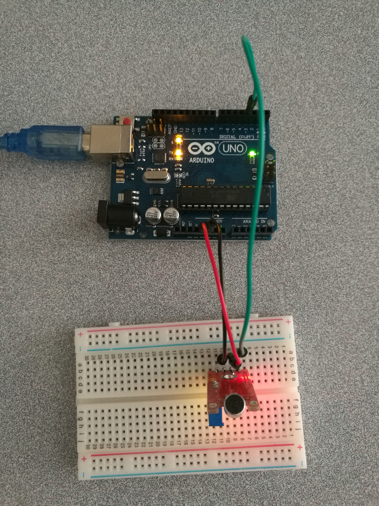

# 5.4 Microphone

## Hardware Wiring


## Sketch
Please refer to [Examples_Arduino - sensor-kit-for-arduino - _034_Microphone - _034_Microphone.ino](https://github.com/LongerVisionRobot/Examples_Arduino/blob/master/sensor-kit-for-arduino/_034_Microphone/_034_Microphone.ino).
```
int Led=13;       // Define LDE Pin
int buttonpin=3;  // Define D0 sensor's pin
int val;          // Define Variable val
void setup()
{
  pinMode(Led,OUTPUT);      // Define LED as output
  pinMode(buttonpin,INPUT); // Define sensor D0 as output
  Serial.begin(9600);
}
void loop()
{
  val=digitalRead(buttonpin); // Assign digital pin 3's value to val
  if(val==HIGH)   // if anything detected by D0 sensor, LED starts flashing
  {
    digitalWrite(Led,HIGH);
  }
  else
  {
    digitalWrite(Led,LOW);
  }
  Serial.println(val, DEC);
}
```