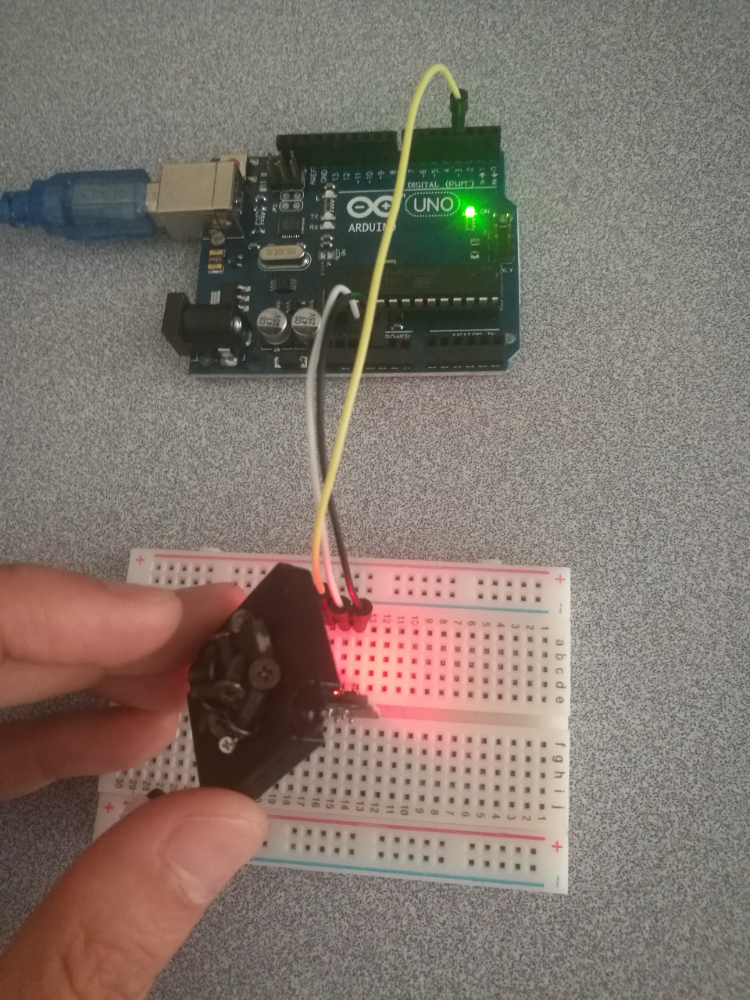

# 6.1 Hall Magnetic Sensor

## Hardware Wiring


## Sketch
Please refer to [Examples_Arduino - sensor-kit-for-arduino - _003_Hall_Magnetic - _003_Hall_Magnetic.ino](https://github.com/LongerVisionRobot/Examples_Arduino/blob/master/sensor-kit-for-arduino/_003_Hall_Magnetic/_003_Hall_Magnetic.ino).
```
int Led=13;   // Define LDE Pin
int SENSOR=3; // Define Hall Magnetic Sensor's pin
int val;      // Define variable val
void setup()
{
  pinMode(Led,OUTPUT);  // Define LED as output
  pinMode(SENSOR,INPUT);// Define Hall Magnetic Sensor as input
}

void loop()
{
  val=digitalRead(SENSOR);  //  Assign the reading digital value from pin 3 to val
  if(val==HIGH) // if anything detected by Hall Magnetic Sensor, LET starts flashing
  {
    digitalWrite(Led, HIGH);
  }
  {
    digitalWrite(Led, LOW);
  }
}
```