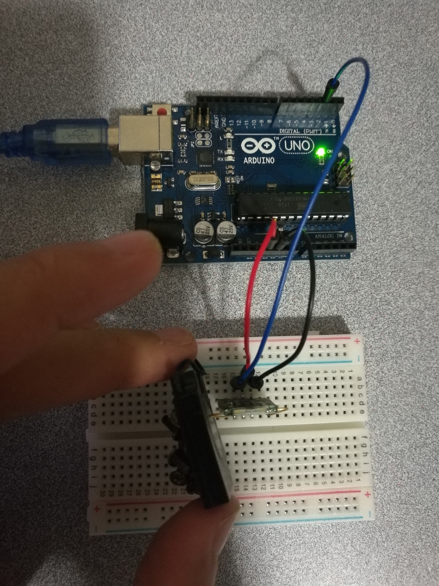

# 6.2 Mini Reed

## Hardware Wiring


## Sketch
```
int Led=13;       // Define LDE Pin
int buttonpin=3;  // 定义磁环传感器接口
int val;          // Define Variable val
void setup()
{
  pinMode(Led,OUTPUT);  // Define LED as output
  pinMode(buttonpin,INPUT);// 定义磁环传感器为输出接口
}
void loop()
{
  val=digitalRead(buttonpin);//将数字接口3的值读取赋给val
  if(val==HIGH)//当磁环传感器检测有信号时，LED 闪烁
  {
    digitalWrite(Led,HIGH);
  }
  else
  {
    digitalWrite(Led,LOW);
  }
}
```