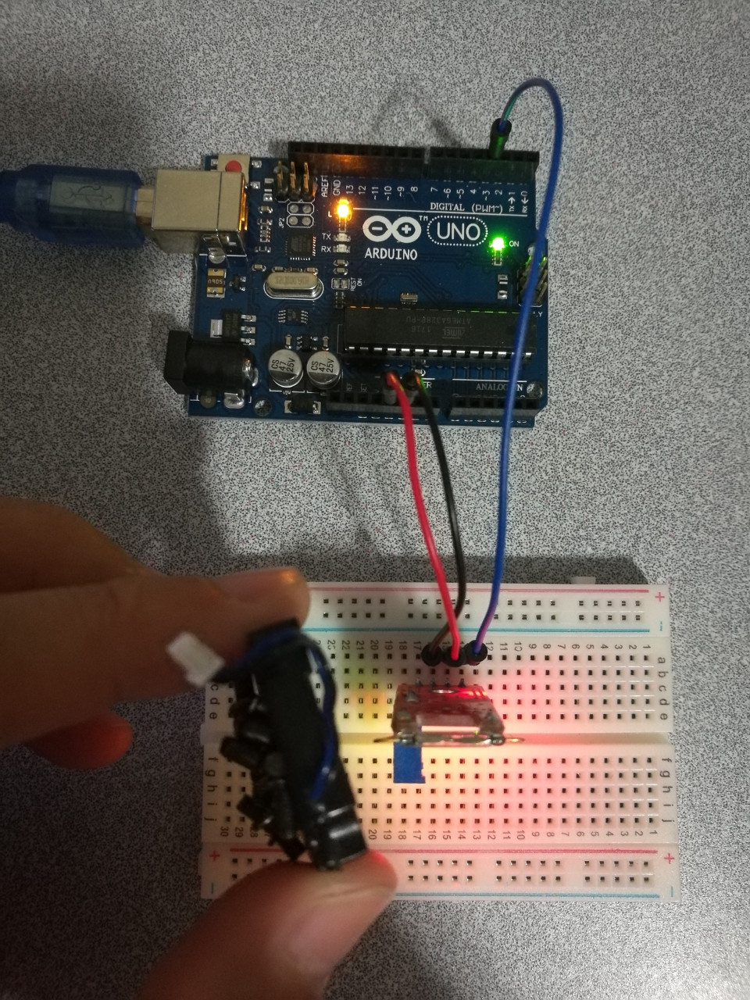

# 6.4 Switch - Reed

## Hardware Wiring




## Sketch

The code can be found at [Examples_Arduino - sensor-kit-for-arduino - _022_Reed - _022_Reed.ino](https://github.com/LongerVisionRobot/Examples_Arduino/blob/master/sensor-kit-for-arduino/_022_Reed/_022_Reed.ino).
```
int Led=13;      // Define LDE Pin
int buttonpin=3; // Define reed sensor's pin
int val;         // Define Variable val
void setup()
{
  pinMode(Led,OUTPUT);  // Define LED as output
  pinMode(buttonpin,INPUT); // Define reed sensor's pin as output
}
void loop()
{
  val=digitalRead(buttonpin); // assign digital pin 3's reading to val
  if(val==HIGH)  // anything detected by linear hall sensor, LED starts
  {
    digitalWrite(Led,HIGH);
  }
  else
  {
    digitalWrite(Led,LOW);
  }
}
```