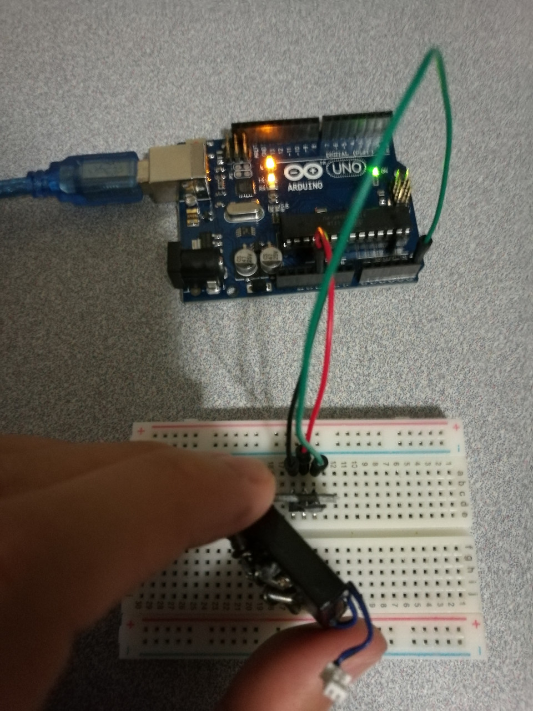

# 6.5 Analog Hall

## Hardware Wiring


## Sketch
Please refer to [Examples_Arduino - sensor-kit-for-arduino - _031_Analog_Hall - _031_Analog_Hall.ino](https://github.com/LongerVisionRobot/Examples_Arduino/blob/master/sensor-kit-for-arduino/_031_Analog_Hall/_031_Analog_Hall.ino).
```
int sensorPin = A5;   // select the input pin for the potentiometer
int ledPin = 13;      // select the pin for the LED
int sensorValue = 0;  // variable to store the value coming from the sensor

void setup() {
  pinMode(ledPin, OUTPUT); 
  Serial.begin(9600); 
}

void loop() { 
  sensorValue = analogRead(sensorPin);    
  digitalWrite(ledPin, HIGH);  
  delay(sensorValue);          
  digitalWrite(ledPin, LOW);   
  delay(sensorValue);
  Serial.println(sensorValue, DEC);  
}
```