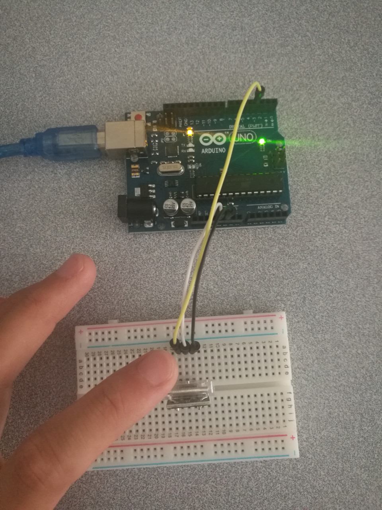

# 7.1 Tap Sensor

## Hardware Wiring


## Sketch
Please refer to [Examples_Arduino - sensor-kit-for-arduino - _002_Tap - _002_Tap.ino](https://github.com/LongerVisionRobot/Examples_Arduino/blob/master/sensor-kit-for-arduino/_002_Tap/_02_Tap.ino).
```
int Led=13;     // Define LDE Pin
int tap=3;      // Define pin for tap sensor
int val;        // Define Variable val
void setup()
{
  pinMode(Led,OUTPUT);  // Define LED as output
  pinMode(tap,INPUT);   // Define tap sensor as input
}

void loop()
{
  val=digitalRead(tap); // assign digital pin 3's reading to val
  if(val==HIGH) // anything detected by tap sensor, LED starts
  {
    digitalWrite(Led,LOW);
  }
  else
  {
    digitalWrite(Led,HIGH);
  }
}
```