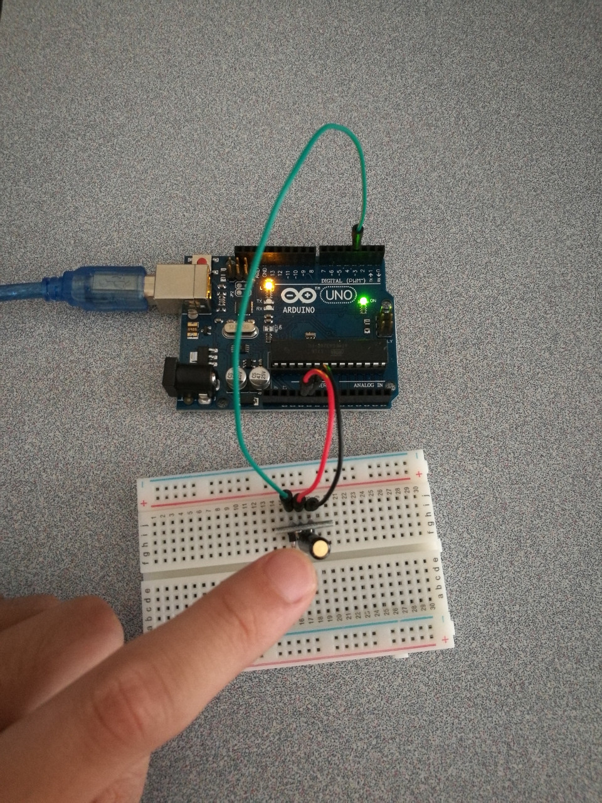

# 7.2 Shock Sensor

## Hardware Wiring




## Sketch

The code can be found at [Examples_Arduino - sensor-kit-for-arduino - _027_Shock - _027_Shock.ino](https://github.com/LongerVisionRobot/Examples_Arduino/blob/master/sensor-kit-for-arduino/_027_Shock/_027_Shock.ino).
```
int Led=13;     // Define LDE Pin
int Shock=3;    // Define pin for shock sensor
int val;        // Define Variable val
void setup()
{
  pinMode(Led,OUTPUT);  // Define LED as output
  pinMode(Shock,INPUT); // Define shock sensor as input
}
void loop()
{
  val=digitalRead(Shock);// assign digital pin 3's reading to val
  if(val==HIGH) // anything detected by shock sensor, LED starts
  {
    digitalWrite(Led,LOW);
  }
  else
  {
    digitalWrite(Led,HIGH);
  }
}
```