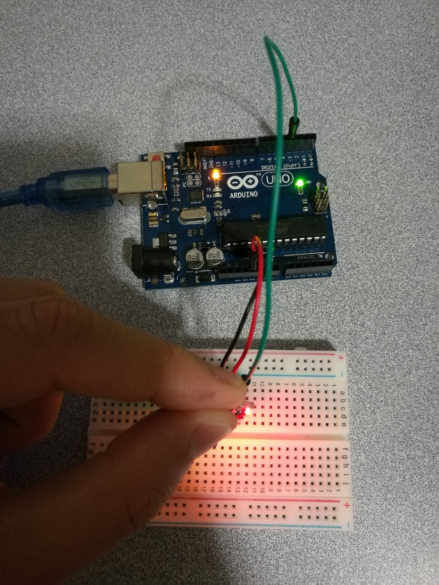

# 7.3 Touch Sensor

## Hardware Wiring




## Sketch

The code can be found at [Examples_Arduino - sensor-kit-for-arduino - _032_Touch - _032_Touch.ino](https://github.com/LongerVisionRobot/Examples_Arduino/blob/master/sensor-kit-for-arduino/_032_Touch/_032_Touch.ino).
```
int Led=13;       // Define LDE Pin
int buttonpin=3;  // Define pin for touch sensor
int val;          // Define Variable val
void setup()
{
  pinMode(Led,OUTPUT);  // Define LED as output
  pinMode(buttonpin,INPUT); // Define touch sensor as input
}
void loop()
{
  val=digitalRead(buttonpin);// assign digital pin 3's reading to val
  if(val==HIGH) // anything detected by touch sensor, LED starts
  {
    digitalWrite(Led,HIGH);
  }
  else
  {
    digitalWrite(Led,LOW);
  }
}
```