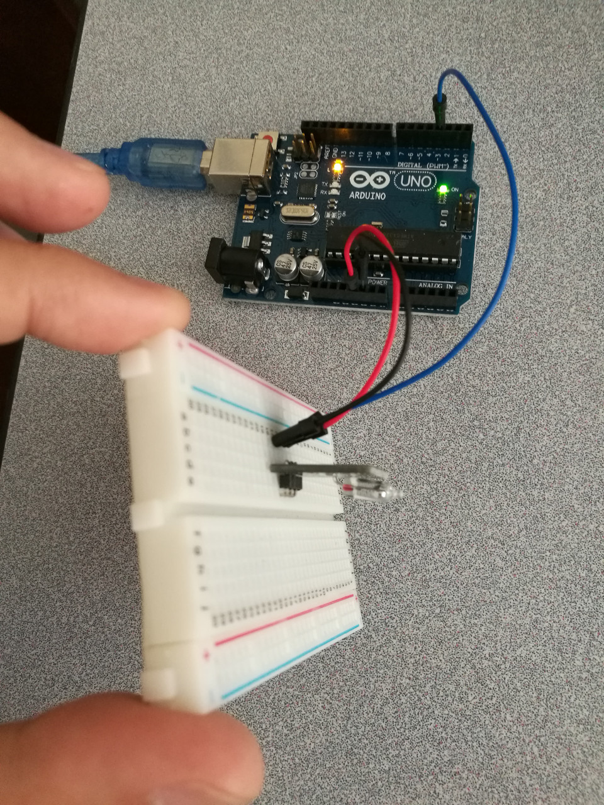

# Switch - Mercury Tilt

## Hardware Wiring


## Sketch
### Emit
```
/*
  Button
 
 Turns on and off a light emitting diode(LED) connected to digital  
 pin 13, when pressing a pushbutton attached to pin 2. 
 
 
 The circuit:
 * LED attached from pin 13 to ground 
 * pushbutton attached to pin 2 from +5V
 * 10K resistor attached to pin 2 from ground
 
 * Note: on most Arduinos there is already an LED on the board
 attached to pin 13.
 
 
 created 2005
 by DojoDave <http://www.0j0.org>
 modified 28 Oct 2010
 by Tom Igoe
 
 This example code is in the public domain.
 
 http://www.arduino.cc/en/Tutorial/Button
 */

// constants won't change. They're used here to 
// set pin numbers:
const int buttonPin = 2;     // the number of the pushbutton pin
const int ledPin =  13;      // the number of the LED pin

// variables will change:
int buttonState = 0;         // variable for reading the pushbutton status

void setup() {
  // initialize the LED pin as an output:
  pinMode(ledPin, OUTPUT);      
  // initialize the pushbutton pin as an input:
  pinMode(buttonPin, INPUT);     
}

void loop(){
  // read the state of the pushbutton value:
  buttonState = digitalRead(buttonPin);

  // check if the pushbutton is pressed.
  // if it is, the buttonState is HIGH:
  if (buttonState == HIGH) {     
    // turn LED on:    
    digitalWrite(ledPin, HIGH);  
  } 
  else {
    // turn LED off:
    digitalWrite(ledPin, LOW); 
  }
}
```
