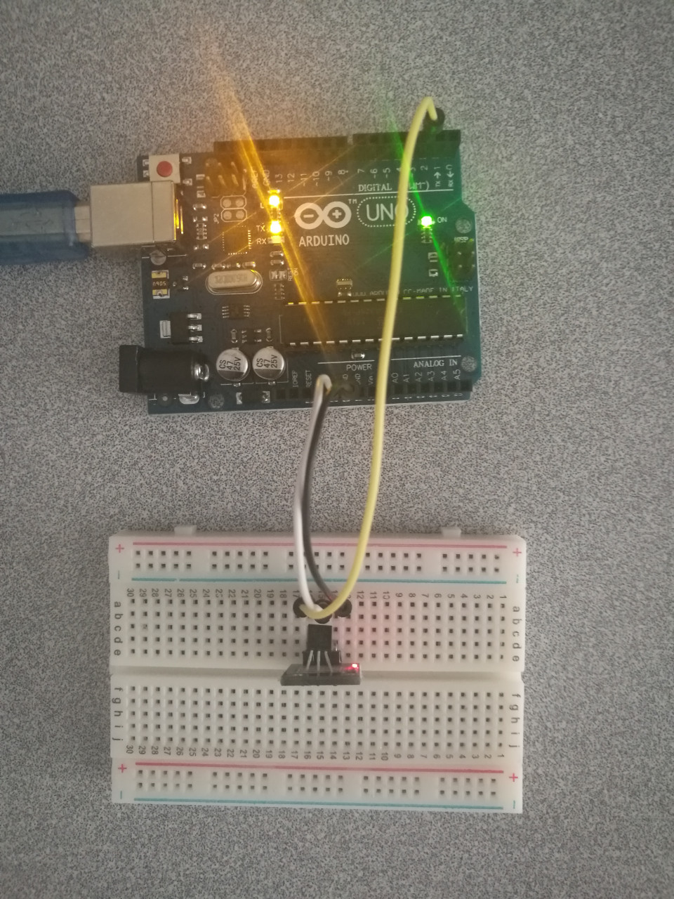

# 8.1 Temperature Sensor - DS18B20

## Hardware Wiring


## Sketch
The code can be found at [Examples_Arduino - sensor-kit-for-arduino - _001_Temperature_DS18B20 - _001_Temperature_DS18B20.ino](https://github.com/LongerVisionRobot/Examples_Arduino/blob/master/sensor-kit-for-arduino/_001_Temperature_DS18B20/_001_Temperature_DS18B20.ino).
```
// Include the libraries we need
#include <OneWire.h>
#include <DallasTemperature.h>

// Data wire is plugged into port 2 on the Arduino
#define ONE_WIRE_BUS 2

// Setup a oneWire instance to communicate with any OneWire devices (not just Maxim/Dallas temperature ICs)
OneWire oneWire(ONE_WIRE_BUS);

// Pass our oneWire reference to Dallas Temperature. 
DallasTemperature sensors(&oneWire);

// arrays to hold device address
DeviceAddress insideThermometer;

/*
 * Setup function. Here we do the basics
 */
void setup(void)
{
  // start serial port
  Serial.begin(9600);
  Serial.println("Dallas Temperature IC Control Library Demo");

  // locate devices on the bus
  Serial.print("Locating devices...");
  sensors.begin();
  Serial.print("Found ");
  Serial.print(sensors.getDeviceCount(), DEC);
  Serial.println(" devices.");

  // report parasite power requirements
  Serial.print("Parasite power is: "); 
  if (sensors.isParasitePowerMode()) Serial.println("ON");
  else Serial.println("OFF");
  
  // Assign address manually. The addresses below will beed to be changed
  // to valid device addresses on your bus. Device address can be retrieved
  // by using either oneWire.search(deviceAddress) or individually via
  // sensors.getAddress(deviceAddress, index)
  // Note that you will need to use your specific address here
  //insideThermometer = { 0x28, 0x1D, 0x39, 0x31, 0x2, 0x0, 0x0, 0xF0 };

  // Method 1:
  // Search for devices on the bus and assign based on an index. Ideally,
  // you would do this to initially discover addresses on the bus and then 
  // use those addresses and manually assign them (see above) once you know 
  // the devices on your bus (and assuming they don't change).
  if (!sensors.getAddress(insideThermometer, 0)) Serial.println("Unable to find address for Device 0"); 
  
  // method 2: search()
  // search() looks for the next device. Returns 1 if a new address has been
  // returned. A zero might mean that the bus is shorted, there are no devices, 
  // or you have already retrieved all of them. It might be a good idea to 
  // check the CRC to make sure you didn't get garbage. The order is 
  // deterministic. You will always get the same devices in the same order
  //
  // Must be called before search()
  //oneWire.reset_search();
  // assigns the first address found to insideThermometer
  //if (!oneWire.search(insideThermometer)) Serial.println("Unable to find address for insideThermometer");

  // show the addresses we found on the bus
  Serial.print("Device 0 Address: ");
  printAddress(insideThermometer);
  Serial.println();

  // set the resolution to 9 bit (Each Dallas/Maxim device is capable of several different resolutions)
  sensors.setResolution(insideThermometer, 9);
 
  Serial.print("Device 0 Resolution: ");
  Serial.print(sensors.getResolution(insideThermometer), DEC); 
  Serial.println();
}

// function to print the temperature for a device
void printTemperature(DeviceAddress deviceAddress)
{
  // method 1 - slower
  //Serial.print("Temp C: ");
  //Serial.print(sensors.getTempC(deviceAddress));
  //Serial.print(" Temp F: ");
  //Serial.print(sensors.getTempF(deviceAddress)); // Makes a second call to getTempC and then converts to Fahrenheit

  // method 2 - faster
  float tempC = sensors.getTempC(deviceAddress);
  Serial.print("Temp C: ");
  Serial.print(tempC);
  Serial.print(" Temp F: ");
  Serial.println(DallasTemperature::toFahrenheit(tempC)); // Converts tempC to Fahrenheit
}
/*
 * Main function. It will request the tempC from the sensors and display on Serial.
 */
void loop(void)
{ 
  // call sensors.requestTemperatures() to issue a global temperature 
  // request to all devices on the bus
  Serial.print("Requesting temperatures...");
  sensors.requestTemperatures(); // Send the command to get temperatures
  Serial.println("DONE");
  
  // It responds almost immediately. Let's print out the data
  printTemperature(insideThermometer); // Use a simple function to print out the data
  delay(200);
}

// function to print a device address
void printAddress(DeviceAddress deviceAddress)
{
  for (uint8_t i = 0; i < 8; i++)
  {
    if (deviceAddress[i] < 16) Serial.print("0");
    Serial.print(deviceAddress[i], HEX);
  }
}
```