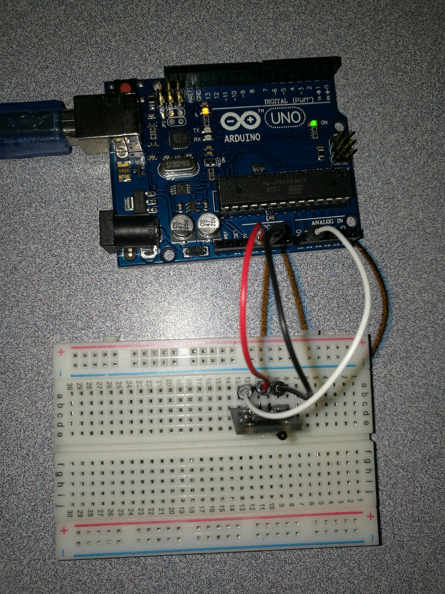

# 8.2 Analog Thermist

## Hardware Wiring




## Sketch

The code can be found at [Examples_Arduino - sensor-kit-for-arduino - _011_AnalogThermister - _011_AnalogThermister.ino](https://github.com/LongerVisionRobot/Examples_Arduino/blob/master/sensor-kit-for-arduino/_011_AnalogThermister/_011_AnalogThermister.ino).
```
#include <math.h>
double Thermister(int RawADC) {
  double Temp;
  Temp = log(((10240000/RawADC) - 10000));
  Temp = 1 / (0.001129148 + (0.000234125 + (0.0000000876741 * Temp * Temp ))* Temp );
  Temp = Temp - 273.15;
  // Convert Kelvin to Celcius
  return Temp;
}
void setup() {
  Serial.begin(9600);
}
void loop() {
  Serial.print(Thermister(analogRead(0)));
  Serial.println("c");
  delay(500);
}
```