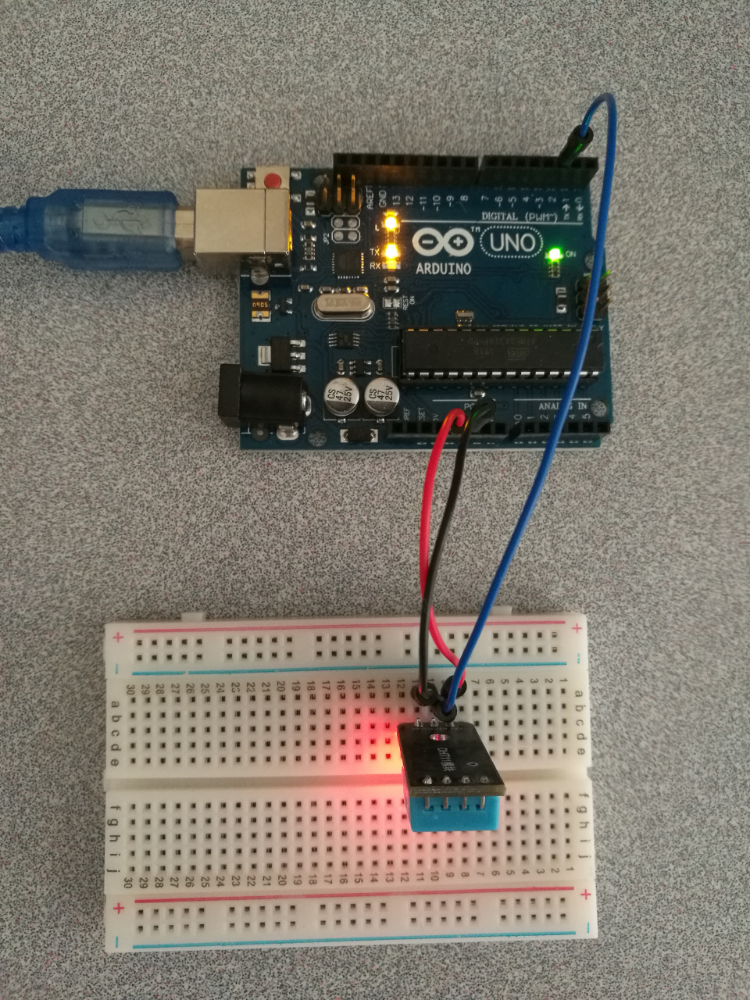

# 8.3 Temperature and Humidity Sensor

## Hardware Wiring


## Sketch
The code can be found at [Examples_Arduino - sensor-kit-for-arduino - _012_DHT11 - _012_DHT11.ino](https://github.com/LongerVisionRobot/Examples_Arduino/blob/master/sensor-kit-for-arduino/_012_DHT11/_012_DHT11.ino).
```
// Example testing sketch for various DHT humidity/temperature sensors
// Written by ladyada, slightly modified, public domain

#include "DHT.h"

#define DHTPIN 2     // what pin we're connected to

// Uncomment whatever type you're using!
#define DHTTYPE DHT11   // DHT 11 
//#define DHTTYPE DHT22   // DHT 22  (AM2302)
//#define DHTTYPE DHT21   // DHT 21 (AM2301)

DHT dht(DHTPIN, DHTTYPE);

void setup() {
  Serial.begin(9600);
  Serial.println("DHT test");

  dht.begin();
}

void loop() {
  // Reading temperature or humidity takes about 250 milliseconds!
  // Sensor readings may also be up to 2 seconds 'old' (its a very slow sensor)
  float h = dht.readHumidity();
  float t = dht.readTemperature();

  // check if returns are valid, if they are NaN (not a number) then something went wrong!
  if (isnan(t) || isnan(h)) {
    Serial.println("Failed to read from DHT");
  } else {
    // Uncomment these lines if you prefer to use the Fahrenheit scale 
    // instead of Celsius. Remember to change line 44 so that the 
    // symbol is "F" instead of "C"
    // float fahrenheitTemp = t * 9.0/5.0+32.0;
    // Serial.print("Temperature: ");
    // Serial.print(fahrenheitTemp);
    // Serial.println(" F");
    
    Serial.print("Humidity: ");
    Serial.print(h);
    Serial.print(" %\t");
    Serial.print("Temperature: ");
    Serial.print(t);
    Serial.println(" *C");
  }
    delay(500);  //Insert a 5sec delay between readings
}
```