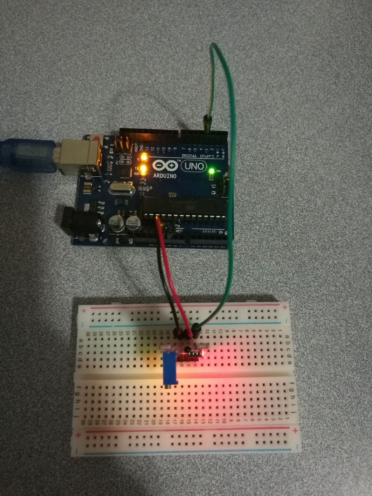

# 8.4 Digital Temperature

## Hardware Wiring




## Sketch

The code can be found at [Examples_Arduino - sensor-kit-for-arduino - _025_DigitalTemperature - _025_DigitalTemperature.ino](https://github.com/LongerVisionRobot/Examples_Arduino/blob/master/sensor-kit-for-arduino/_025_DigitalTemperature/_025_DigitalTemperature.ino).
```
int Led=13;       // Define LDE Pin
int buttonpin=3;  // Define pin for digital tempature sensor
int val;          // Define Variable val
void setup()
{
  pinMode(Led,OUTPUT);  // Define pin for tap sensor
  pinMode(buttonpin,INPUT);// Define digital temperature sensor as input
  Serial.begin(9600);
}
void loop()
{
  val=digitalRead(buttonpin); // assign digital pin 3's reading to val
  Serial.println(val);
  if(val==HIGH) // anything detected by digital temperature sensor, LED starts
  {
    digitalWrite(Led,HIGH);
  }
  else
  {
    digitalWrite(Led,LOW);
  }
}
```