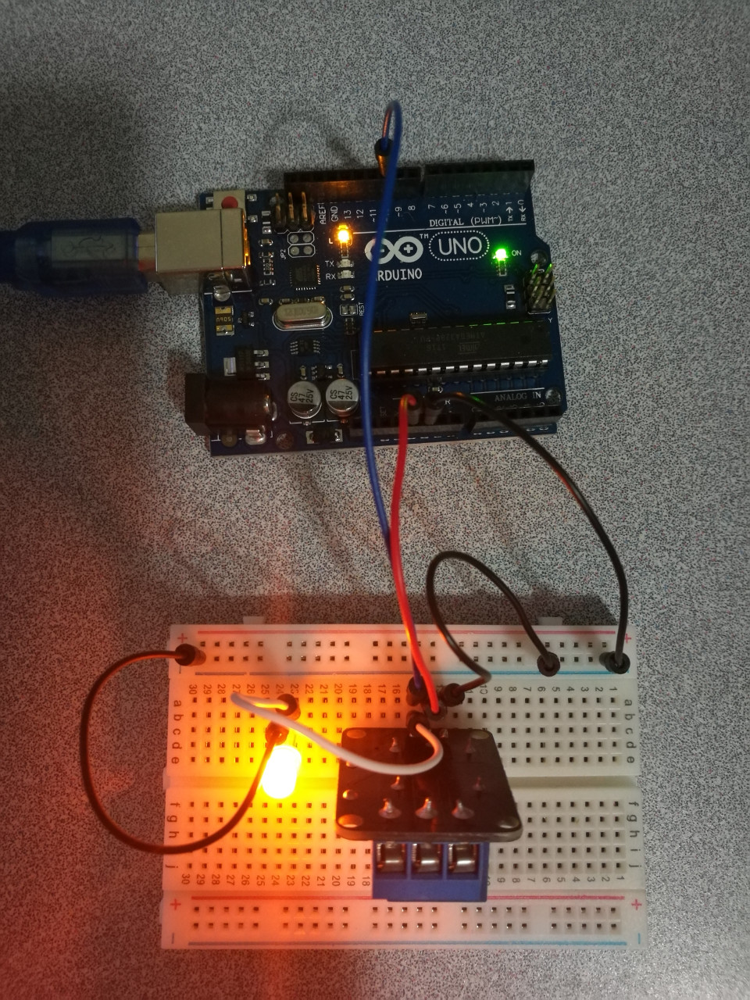

# 9.4 Relay

## Hardware Wiring




## Sketch

The code can be found at [Examples_Arduino - sensor-kit-for-arduino - _016_Relay - _016_Relay.ino](https://github.com/LongerVisionRobot/Examples_Arduino/blob/master/sensor-kit-for-arduino/_016_Relay/_016_Relay.ino).
```
int relay = 10; // Define relay pin
void setup()
{
  pinMode(relay,OUTPUT); // Define relay pin as output
}
void loop()
{
  digitalWrite(relay,HIGH); // Relay open
  delay(1000);
  digitalWrite(relay,LOW);  // Relay close
  delay(1000);
}
```