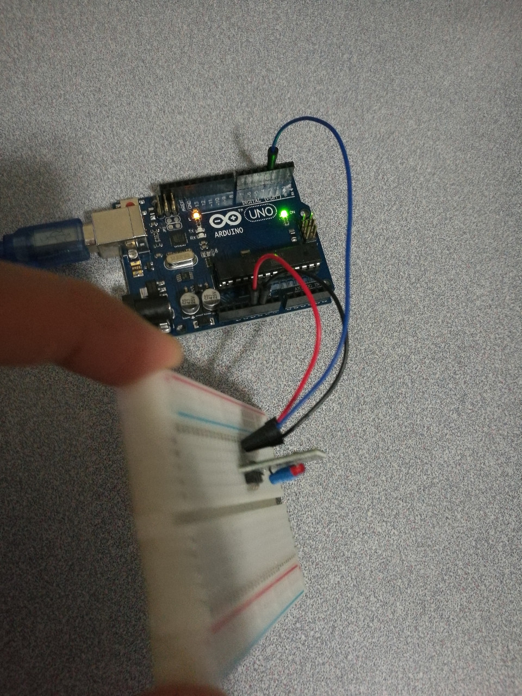

# 9.3 Switch - Ball

## Hardware Wiring


## Sketch
The code can be found at [Examples_Arduino - sensor-kit-for-arduino - _017_Switch_Ball - _017_Switch_Ball.ino](https://github.com/LongerVisionRobot/Examples_Arduino/blob/master/sensor-kit-for-arduino/_017_Switch_Ball/_017_Switch_Ball.ino).
```
int Led=13;       // Define LDE Pin
int buttonpin=3;  // Define Switch's pin
int val;          // Define Variable val
void setup()
{
  pinMode(Led,OUTPUT);  // Define LED as output
  pinMode(buttonpin,INPUT); // Define switch as input
}
void loop()
{
  val=digitalRead(buttonpin); // Assign digital pin's reading to val
  if(val==HIGH) // if switch pressed, LED starts flashing
  {
    digitalWrite(Led,HIGH);
  }
  else
  {
    digitalWrite(Led,LOW);
  }
}
```