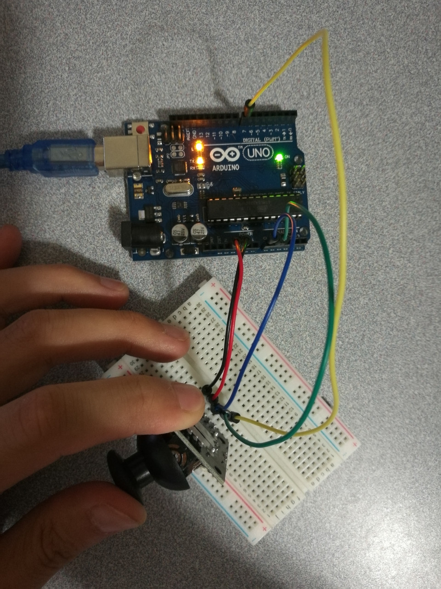

# 10.1 Joystick

## Hardware Wiring




## Sketch

The code can be found at [Examples_Arduino - sensor-kit-for-arduino - _020_Joystick - _020_Joystick.ino](https://github.com/LongerVisionRobot/Examples_Arduino/blob/master/sensor-kit-for-arduino/_020_Joystick/_020_Joystick.ino).
```
int sensorPin = 5;
int value = 0;
void setup() {
  pinMode(7, OUTPUT);
  Serial.begin(9600);
}
void loop() {
  value = analogRead(0);
  Serial.print("X:");
  Serial.print(value, DEC);
  value = analogRead(1);
  Serial.print(" | Y:");
  Serial.print(value, DEC);
  value = digitalRead(7);
  Serial.print(" | Z: ");
  Serial.println(value, DEC);
  delay(100);
}
```