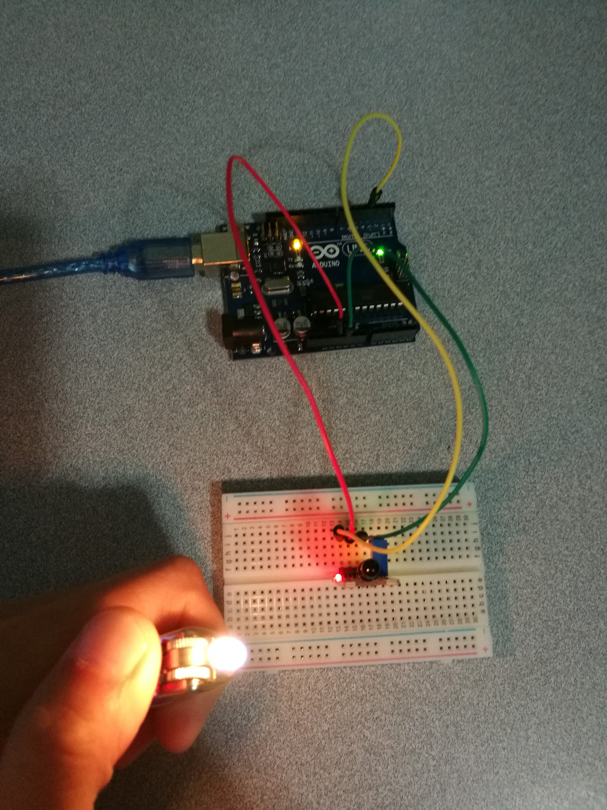

# 10.2 Flame

## Hardware Wiring




## Sketch

The code can be found at [Examples_Arduino - sensor-kit-for-arduino - _023_Flame - _023_Flame.ino](https://github.com/LongerVisionRobot/Examples_Arduino/blob/master/sensor-kit-for-arduino/_023_Flame/_023_Flame.ino).
```
int Led=13;       // Define LDE Pin
int buttonpin=3;  // Define Flame Sensor Pin
int val;          // Define Variable val
void setup()
{
  pinMode(Led,OUTPUT); // Define LED as output
  pinMode(buttonpin,INPUT); // Define flame detector as input
}
void loop()
{
  val=digitalRead(buttonpin);// Assign digitl pin's reading to val
  if(val==HIGH)   // If flame detected, LED starts flashing
  {
    digitalWrite(Led,HIGH);
  }
  else
  {
    digitalWrite(Led,LOW);
  }
}
```