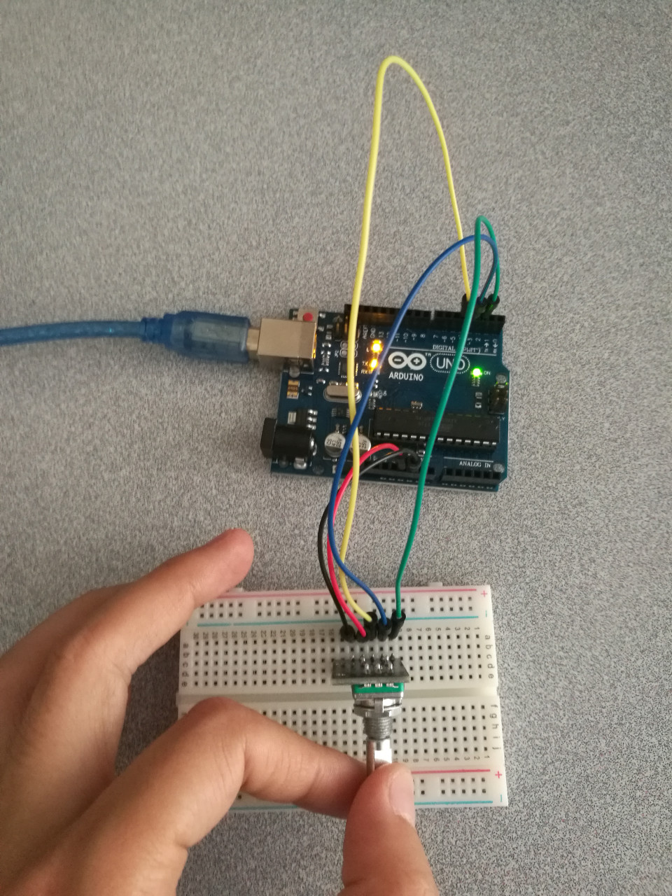

# 10.4 Rotary Encoders

## Hardware Wiring




## Sketch

The code can be found at [Examples_Arduino - sensor-kit-for-arduino - _036_RotaryEncoders - _036_RotaryEncoders.ino](https://github.com/LongerVisionRobot/Examples_Arduino/blob/master/sensor-kit-for-arduino/_036_RotaryEncoders/_036_RotaryEncoders.ino).
```
const int interruptA = 0;       // Interrupt 0 - pin 2
const int interruptB = 1;       // Interrupt 1 - pin 3  NO USE

int CLK = 2;     // PIN2
int DAT = 3;     // PIN3
int BUTTON = 4;  // PIN4
int LED1 = 5;    // PIN5
int LED2 = 6;    // PIN6
int COUNT = 0;

void setup() 
 {
  attachInterrupt(interruptA, RoteStateChanged, FALLING);
 // attachInterrupt(interruptB, buttonState, FALLING);
  pinMode(CLK, INPUT); 
  digitalWrite(2, HIGH);  // Pull High Restance  
  pinMode(DAT, INPUT); 
  digitalWrite(3, HIGH);  // Pull High Restance 
  pinMode(BUTTON, INPUT); 
  digitalWrite(4, HIGH);  // Pull High Restance
  pinMode(LED1, OUTPUT); 
  pinMode(LED2, OUTPUT); 
   Serial.begin(9600);
 }

void loop() 
{
  if  (!(digitalRead(BUTTON))) 
    {
     COUNT = 0;  
     Serial.println("STOP COUNT = 0");
     digitalWrite(LED1, LOW);
     digitalWrite(LED2, LOW);
     delay (2000);
    }
     Serial.println(COUNT);  
}

//-------------------------------------------
void RoteStateChanged() //When CLK  FALLING READ DAT
{
 if  (digitalRead(DAT)) // When DAT = HIGH IS FORWARD
   {
    COUNT++;
    digitalWrite(LED1, HIGH);
    digitalWrite(LED2, LOW);
    delay(20);
   }
 else                   // When DAT = LOW IS BackRote
   {
    COUNT--;
    digitalWrite(LED2, HIGH);
    digitalWrite(LED1, LOW);
    delay(20);
   }
}

```