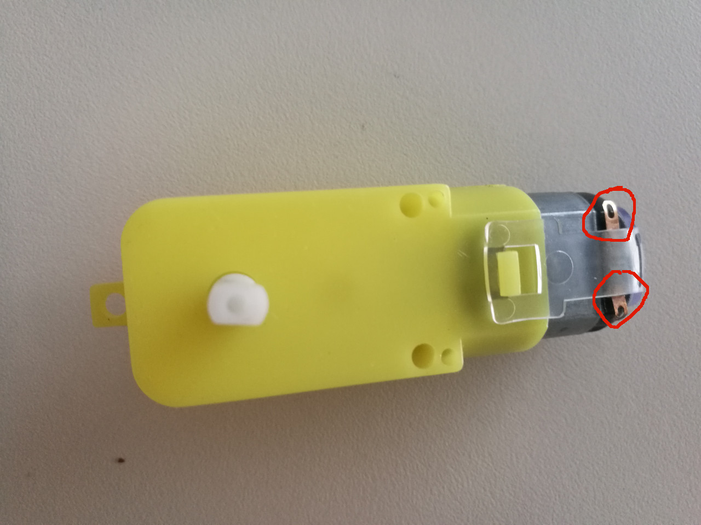
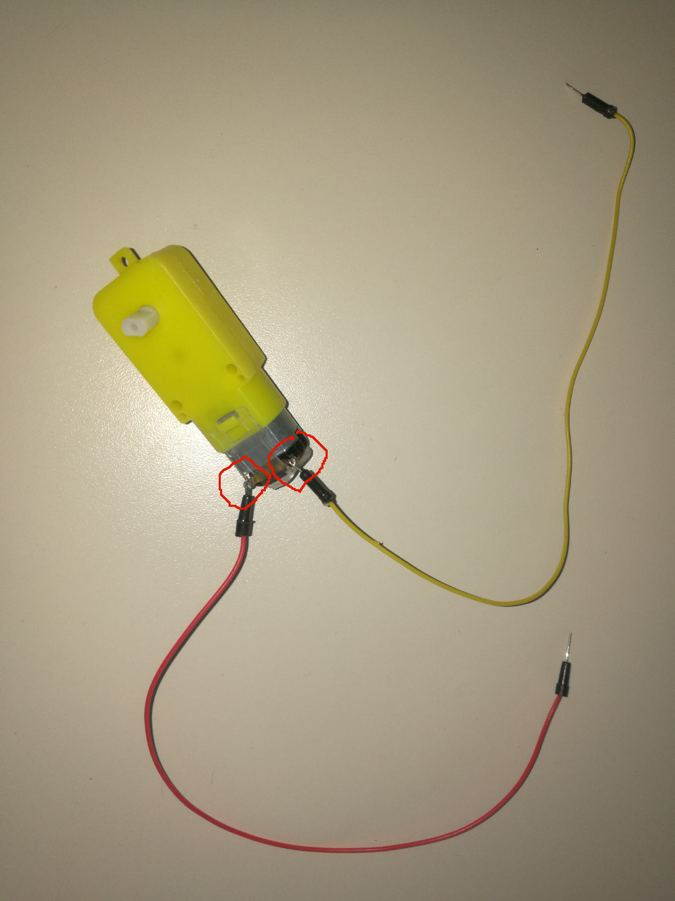
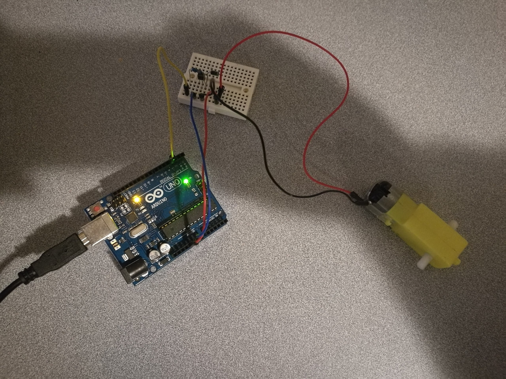

# 12.1 DC Motor

The DC gear motor to be used is of 3~5V, which looks as:


In order to estimate the race car's speed, we also provide a speed encoder for each DC motor.


Clearly, two welding spots come with the DC motor, which we need to weld out the electrical wires manually.



## Hardware Wiring


## Sketch
Please refer to [https://learn.adafruit.com/adafruit-arduino-lesson-13-dc-motors/overview](http://www.geek-workshop.com/thread-4360-1-1.html).
```
/*
/*
Adafruit Arduino - Lesson 13. DC Motor
*/
 
 
int motorPin = 3;
 
void setup() 
{ 
  pinMode(motorPin, OUTPUT);
  Serial.begin(9600);
  while (! Serial);
  Serial.println("Speed 0 to 255");
} 
 
 
void loop() 
{ 
  if (Serial.available())
  {
    int speed = Serial.parseInt();
    if (speed >= 0 && speed <= 255)
    {
      analogWrite(motorPin, speed);
    }
  }
} 
```


## Note
We will use 4 **L298N** DC motors in our race car. Please refer to [**Chapter 15.1 - 4-Wheel Driven Using 4 DC Motors**](../../Part6_MiniAutomatedVehicle/15_Assembling/01_4wheel_dcmotor_driven.md) for more details.
