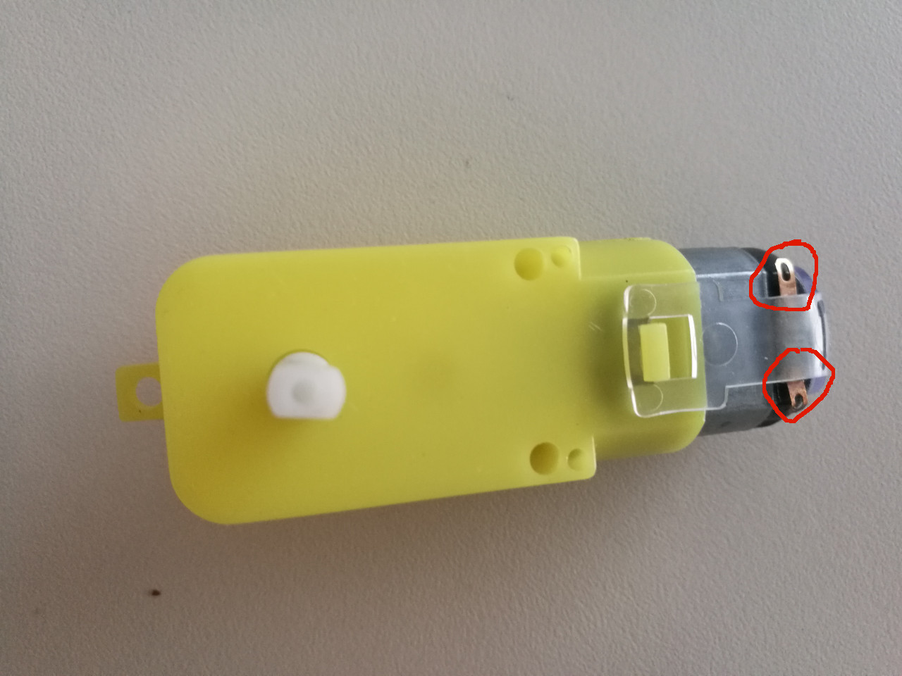
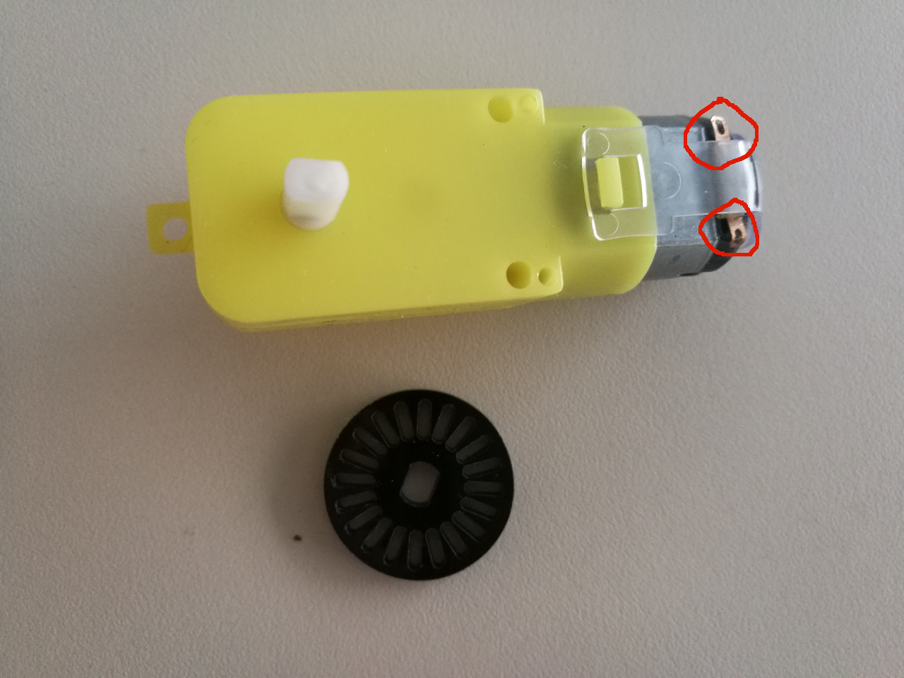

# 12.1 DC Motor

The DC gear motor to be used is of 3~5V, which looks as:


In order to estimate the race car's speed, we also provide a speed encoder for each DC motor.


Clearly, two welding spots come with the DC motor, which we need to weld out the electrical wires manually.


## Hardware Wiring


## Sketch
Please refer to [http://www.geek-workshop.com/thread-4360-1-1.html](http://www.geek-workshop.com/thread-4360-1-1.html).
```
/*
为了看清电机的转动，使用了 带齿轮减速箱的微型马达，
由于它的需要的电压低，可以直接使用Arduino板上的5伏电压。

L298N也使Arduino板载 5伏电压

L298N电机驱动自己焊的
*/

//这个电机驱动板使用数字端口4 5 6 7 控制电机
//正确连接你的电机到M1+ M1- M2+ M2-
//数字端口10 11 连接到L298N的使能端接口
//下载代码到Arduino/
// 控制两个直流电机的正反转
//本程序作用两个直流电机先正转一秒 暂停一秒 反转一秒 如此反复
  

int IN1=4;
int IN2=5;
int IN3=6;
int IN4=7;

int EN1=10;//使能端口1
int EN2=11;//使能端口2
//数字端口4与5为一组，6与7为另一组
//数字端口10 11 作为直流电机的使能端
void Motor1(boolean reverse)//电机1正转
{
  if (reverse) //正转
  {
    digitalWrite(IN1,HIGH);
    digitalWrite(IN2,LOW);
  }

  else //反转
  {
    digitalWrite(IN1,LOW);
    digitalWrite(IN2,HIGH);
  }
}

void Motor2(boolean reverse)//电机2转动
{
  if (reverse) //正转
  {
    digitalWrite(IN3,HIGH);
    digitalWrite(IN4,LOW);
  }

  else //反转
  {
    digitalWrite(IN3,LOW);
    digitalWrite(IN4,HIGH);
  }
}

void aa()//先正转1秒停1秒后反转1秒
{
  //正转
  digitalWrite(IN3,LOW);
  digitalWrite(IN4,HIGH);
  digitalWrite(IN1,LOW);
  digitalWrite(IN2,HIGH); 
  delay(1000);

  //暂停一秒
  stopMotor(true);
  delay(1000); 
  stopMotor(false);//恢复电机使能端高电平


  //反转
  digitalWrite(IN3,HIGH);
  digitalWrite(IN4,LOW);
  digitalWrite(IN1,HIGH);
  digitalWrite(IN2,LOW);


  delay(1000);
  // 暂停
  stopMotor(true);
  delay(1000); 
  stopMotor(false);
}

void stopMotor(boolean r)//电机停转
{
  if (r)
  {
    analogWrite(EN1,0);
    analogWrite(EN2,0);
  }
  else
  {
    analogWrite(EN1,255); 
    analogWrite(EN2,255);
  }
} 

void setup()
{
  int i;


  for (i=4;i<=7;i++) //为Ardunio 电机驱动板
    pinMode(i,OUTPUT); //设置数字端口4,5,6,7为输出模式

  for (i=4;i<=7;i++) 
    digitalWrite(i,OUTPUT); //设置数字端口4,5,6,7为HIGH,电机保持不动


  pinMode(10,OUTPUT);//设置数字端口10  11为输出模式
  pinMode(11,OUTPUT);
  Serial.begin(9600);
}

void loop()
{
  aa();//两个直流电机正转1秒 暂停一秒 反转一秒
}
```


## Note
We will use 4 **L298N** DC motors in our race car. Please refer to [**Chapter 15.1 - 4-Wheel Driven Using 4 DC Motors**](../../Part6_MiniAutomatedVehicle/15_Assembling/01_4wheel_dcmotor_driven.md) for more details.
