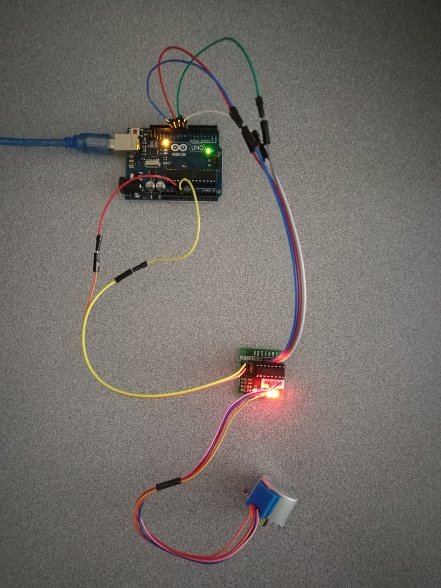

# 12.3 Stepper Motor

We do **NOT** provide any stepper motor in our race car kit. Here, we are using a 5V 28BYJ-48 step motor (in the following image) for testing.


## Hardware Wiring


## Sketch
The code can be found at [Examples_Arduino - geek-workshop - essence - _002_Stepper - _002_Stepper.ino](https://github.com/LongerVisionRobot/Examples_Arduino/blob/master/geek-workshop/essence/_002_Stepper/_002_Stepper.ino).
```
// http://blog.sina.com.cn/s/blog_8043e91a0102wiar.html
// Use the default Stepper.h in the Stepper library coming with Arduino IDE.
#include "Stepper.h" 

// We FIRST define how many steps in 1 round 
#define STEPS 100 

// Set steps and pins for the stepper (corresponding to 4 digital pins: IN0～IN4)
Stepper stepper(STEPS, 8, 9, 10, 11);

void setup() { 
  // Define the stepper's rotating speed, 90 steps 1 minute
  stepper.setSpeed(90); 
  // Initialize Serial port, for displaying output messages
  Serial.begin(9600);
}

void loop() { 
  // Rotating clockwise 1 round 
  Serial.println("shun");
  stepper.step(2048);
  // 4-step mode, 1 round has 2048 steps. 
  delay(50); 
  // Rotating anti-clockwise half round 
  Serial.println("ni");
  stepper.step(-1024); 
  // 4-step mode, 1 round has 2048 steps. 
  delay(50);
}
```
