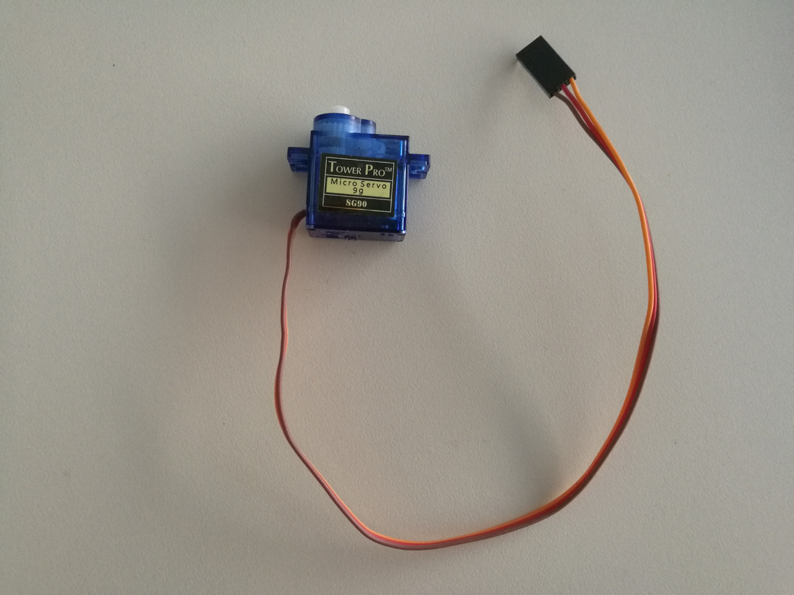
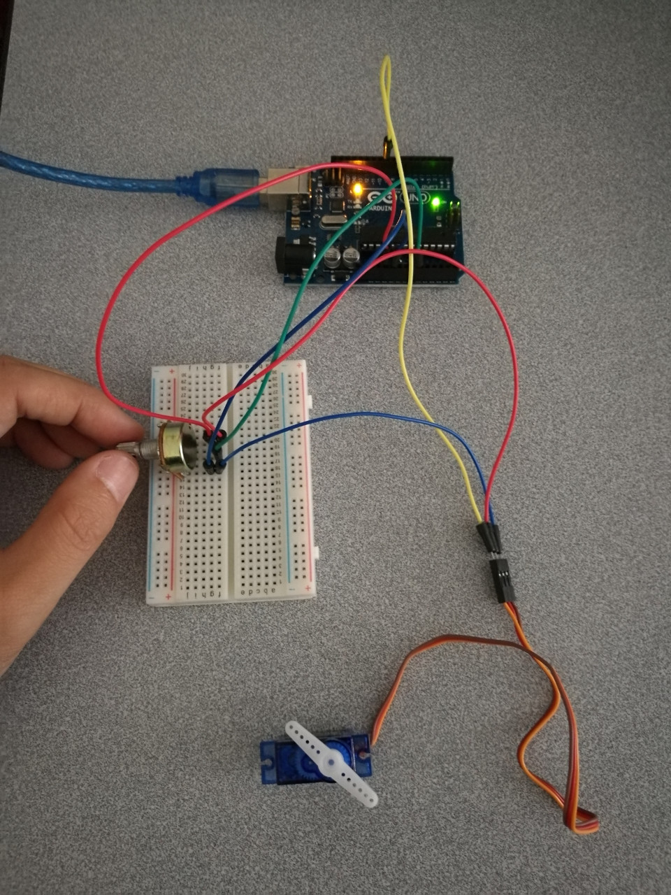
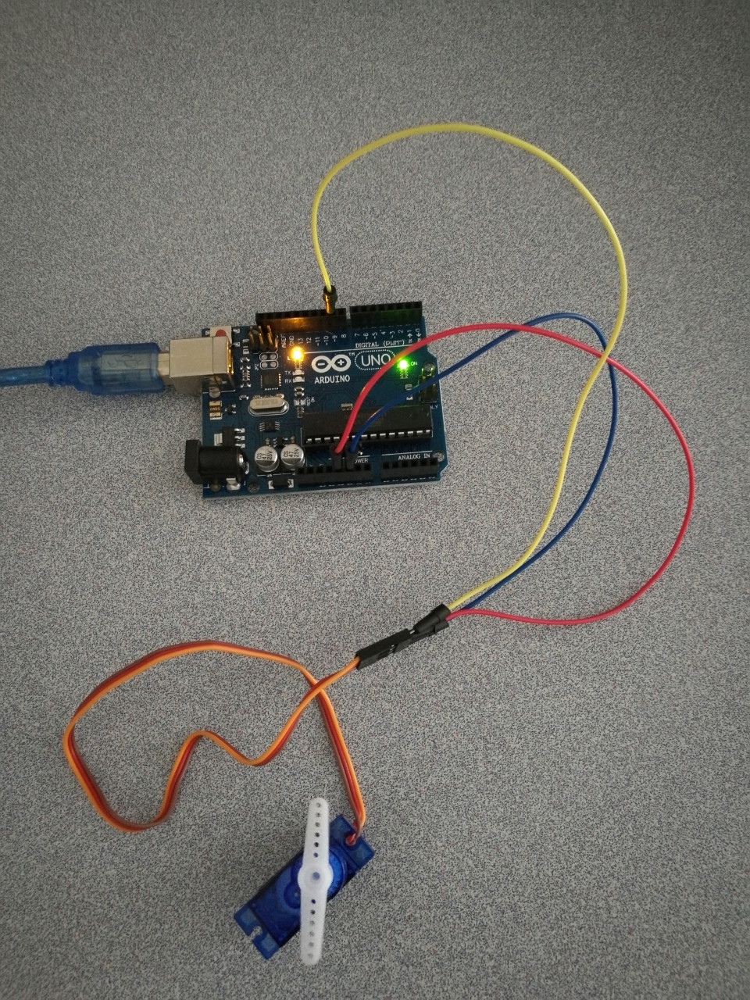

# 12.4 Servo Motor

We provide a Micro Servo SG90 in our race car kit, which looks like:


## Example 1: Knob
Directly referenced from [Official Arduino Tutorial - Knob](https://www.arduino.cc/en/Tutorial/Knob).

### Hardware Wiring


### Sketch
```
/*
 Controlling a servo position using a potentiometer (variable resistor)
 by Michal Rinott <http://people.interaction-ivrea.it/m.rinott>

 modified on 8 Nov 2013
 by Scott Fitzgerald
 http://www.arduino.cc/en/Tutorial/Knob
*/

#include <Servo.h>

Servo myservo;  // create servo object to control a servo

int potpin = 0;  // analog pin used to connect the potentiometer
int val;    // variable to read the value from the analog pin

void setup() {
  myservo.attach(9);  // attaches the servo on pin 9 to the servo object
}

void loop() {
  val = analogRead(potpin);            // reads the value of the potentiometer (value between 0 and 1023)
  val = map(val, 0, 1023, 0, 180);     // scale it to use it with the servo (value between 0 and 180)
  myservo.write(val);                  // sets the servo position according to the scaled value
  delay(15);                           // waits for the servo to get there
}
```

## Example 2: Sweep
Directly referenced from [Official Arduino Tutorial - Sweep](https://www.arduino.cc/en/Tutorial/Sweep).

### Hardware Wiring


### Sketch
```
/* Sweep
 by BARRAGAN <http://barraganstudio.com>
 This example code is in the public domain.

 modified 8 Nov 2013
 by Scott Fitzgerald
 http://www.arduino.cc/en/Tutorial/Sweep
*/

#include <Servo.h>

Servo myservo;  // create servo object to control a servo
// twelve servo objects can be created on most boards

int pos = 0;    // variable to store the servo position

void setup() {
  myservo.attach(9);  // attaches the servo on pin 9 to the servo object
}

void loop() {
  for (pos = 0; pos <= 180; pos += 1) { // goes from 0 degrees to 180 degrees
    // in steps of 1 degree
    myservo.write(pos);              // tell servo to go to position in variable 'pos'
    delay(15);                       // waits 15ms for the servo to reach the position
  }
  for (pos = 180; pos >= 0; pos -= 1) { // goes from 180 degrees to 0 degrees
    myservo.write(pos);              // tell servo to go to position in variable 'pos'
    delay(15);                       // waits 15ms for the servo to reach the position
  }
}
```

## Assignment: Pan Tilt
### Hardware Wiring
The hardware wiring is left for students to finish as an in-class assignment. The expected result can be referred to
[**Chapter 13.2 - Pan Tilt Control by 2 Servo Motors**](../../Part5_MiniAutomatedVehicle/14_Assembling/02_pantilt_servomotor.md). 

### Sketch
```
// http://www.robotoid.com/appnotes/arduino-operating-two-servos.html

#include <Servo.h>

int x = 0;
Servo servoPan;          // Define pan servo
Servo servoTilt;         // Define tilt servo

void setup() { 
  servoPan.attach(10);  // Set pan servo to digital pin 10
  servoTilt.attach(9);  // Set tilt servo to digital pin 9
} 

void loop() {            // Loop through motion tests
  forward();             // Example: move forward
  delay(2000);           // Wait 2000 milliseconds (2 seconds)
  reverse();
  delay(2000);
  turnRight();
  delay(2000);
  turnLeft();
  delay(2000);
  stopRobot();
  delay(2000);
}

// Motion routines for forward, reverse, turns, and stop
void forward() {
  servoPan.write(0);
  servoTilt.write(180);
}

void reverse() {
  servoPan.write(180);
  servoTilt.write(0);
}

void turnRight() {
  servoPan.write(180);
  servoTilt.write(180);
}
void turnLeft() {
  servoPan.write(0);
  servoTilt.write(0);
}

void stopRobot() {
  servoPan.write(90);
  servoTilt.write(90);
}
```
