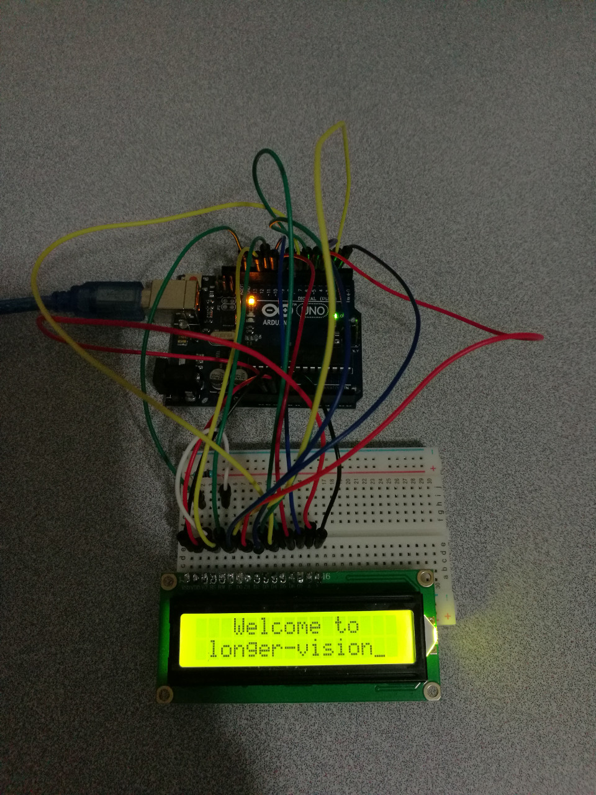

# 13.2 Crystal Display 1602A


## Hardware Wiring




## Sketch
```
int DI = 12;
int RW = 11;
int DB[] = {3, 4, 5, 6, 7, 8, 9, 10};//Use an array to define all needed pins
int Enable = 2;

void LcdCommandWrite(int value) {
// define for all pins
int i = 0;
for (i=DB[0]; i <= DI; i++)   //assign all data bus
{
   digitalWrite(i,value & 01);  // 1602 Crystal Display sequence: D7->D0, instead of D0->D7, this is used to revert the signal sequence.
   value >>= 1;
}
digitalWrite(Enable,LOW);
delayMicroseconds(1);
digitalWrite(Enable,HIGH);
delayMicroseconds(1);  // delay 1ms
digitalWrite(Enable,LOW);
delayMicroseconds(1);  // delay 1ms
}

void LcdDataWrite(int value) {
// define for all pins
int i = 0;
digitalWrite(DI, HIGH);
digitalWrite(RW, LOW);
for (i=DB[0]; i <= DB[7]; i++) {
   digitalWrite(i,value & 01);
   value >>= 1;
}
digitalWrite(Enable,LOW);
delayMicroseconds(1);
digitalWrite(Enable,HIGH);
delayMicroseconds(1);
digitalWrite(Enable,LOW);
delayMicroseconds(1);   // Deplay 1ms
}

void setup (void) {
int i = 0;
for (i=Enable; i <= DI; i++) {
   pinMode(i,OUTPUT);
}
delay(100);
// 短暂的停顿后初始化LCD
// 用于LCD控制需要
LcdCommandWrite(0x38);  // Setup 8-bit interface, 2-line display, 5x7 character size
delay(64);                      
LcdCommandWrite(0x38);  // Setup 8-bit interface, 2-line display, 5x7 character size
delay(50);                      
LcdCommandWrite(0x38);  // Setup 8-bit interface, 2-line display, 5x7 character size
delay(20);                      
LcdCommandWrite(0x06);  // Setup input
                        // Automatic Increasement, no shift
delay(20);                      
LcdCommandWrite(0x0E);  // Setup display
                        // Turn on screen, display cursor, no flashing
delay(20);                      
LcdCommandWrite(0x01);  // Clear up screen, cursor's position -> 0
delay(100);                      
LcdCommandWrite(0x80);  // Setup display
                        // Turn on screen, display cursor, no flashing
delay(20);                      
}

void loop (void) {
  LcdCommandWrite(0x01);  // Clear up screen, cursor's position -> 0
  delay(10); 
  LcdCommandWrite(0x80+3); 
  delay(10);                     
  // 写入欢迎信息 
  LcdDataWrite('W');
  LcdDataWrite('e');
  LcdDataWrite('l');
  LcdDataWrite('c');
  LcdDataWrite('o');
  LcdDataWrite('m');
  LcdDataWrite('e');
  LcdDataWrite(' ');
  LcdDataWrite('t');
  LcdDataWrite('o');
  delay(10);
  LcdCommandWrite(0xc0+1);  // Set the cursor's location: 2nd line, 2nd position
  delay(10); 
  LcdDataWrite('l');
  LcdDataWrite('o');
  LcdDataWrite('n');
  LcdDataWrite('g');
  LcdDataWrite('e');
  LcdDataWrite('r');
  LcdDataWrite('-');
  LcdDataWrite('v');
  LcdDataWrite('i');
  LcdDataWrite('s');
  LcdDataWrite('i');
  LcdDataWrite('o');
  LcdDataWrite('n');
  delay(5000);
  LcdCommandWrite(0x01);  // Clear up screen, cursor's position -> 0
  delay(10);
  LcdDataWrite('I');
  LcdDataWrite(' ');
  LcdDataWrite('a');
  LcdDataWrite('m');
  LcdDataWrite(' ');
  LcdDataWrite('d');
  LcdDataWrite('r');
  LcdDataWrite('.');
  LcdDataWrite('p');
  LcdDataWrite('e');
  LcdDataWrite('i');
  delay(3000);
  LcdCommandWrite(0x02);  // Set the mode to: "New characters are used to replace old characters; No change where there is NO characters." 
  delay(10);
  LcdCommandWrite(0x80+5);  // Set the cursor's location: 1st line, 6th position
  delay(10);  
  LcdDataWrite('t');
  LcdDataWrite('h');
  LcdDataWrite('e');
  LcdDataWrite(' ');
  LcdDataWrite('a');
  LcdDataWrite('d');
  LcdDataWrite('m');
  LcdDataWrite('i');
  LcdDataWrite('n');
  delay(5000);
}
```
