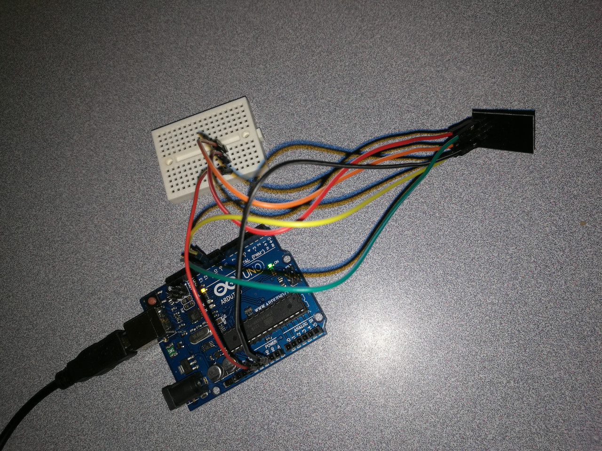
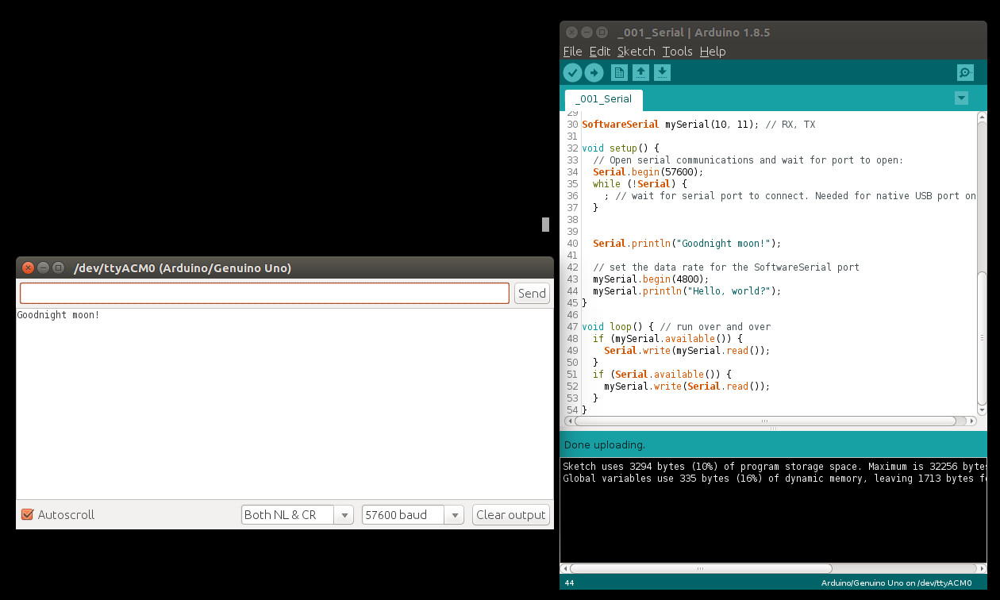

# 14.1 Serial


## Hardware Wiring
Cited directly from [https://www.arduino.cc/en/Tutorial/SoftwareSerialExample](https://www.arduino.cc/en/Tutorial/SoftwareSerialExample):
> "There is no circuit for this example. Make sure that your Arduino or Genuino board is attached to your computer via USB to enable serial communication through the serial monitor window of the Arduino Software (IDE).".

Due to the comments inside the sketch code,
> "The circuit:
> * RX is digital pin 10 (connect to TX of other device)
> * TX is digital pin 11 (connect to RX of other device)"

So, to test the serial communication, it's better we found some device/module, which comes with an **RX** and **TX** pins. Therefore, we carry out the test with a Wifi ESP8266 module, which will be detailedly discussed again in [**14.2 Wifi - ESP8266**](../../Part5_Communication/14_Communication/02_wifi.md).

We then connect the pins as:

ESP8266 | Arduino UNO R3  
--------- | ------- 
<center>GND</center> | <center>GND</center>
<center>VCC</center> | <center>3.3V</center>
<center>CH_PD</center> | <center>3.3V</center>
<center>TX</center> | <center>Virtual RX, namely, pin 10</center>
<center>RX</center> | <center>Virtual TX, namely, pin 11</center>




## Sketch
The code can be found at [Examples_Arduino - arduinocc - _001_Serial - _001_Serial.ino](https://github.com/LongerVisionRobot/Examples_Arduino/blob/master/arduinocc/_001_Serial/_001_Serial.ino), which is directly copied from [https://www.arduino.cc/en/Tutorial/SoftwareSerialExample](https://www.arduino.cc/en/Tutorial/SoftwareSerialExample).
```
/*
  Software serial multple serial test

 Receives from the hardware serial, sends to software serial.
 Receives from software serial, sends to hardware serial.

 The circuit:
 * RX is digital pin 10 (connect to TX of other device)
 * TX is digital pin 11 (connect to RX of other device)

 Note:
 Not all pins on the Mega and Mega 2560 support change interrupts,
 so only the following can be used for RX:
 10, 11, 12, 13, 50, 51, 52, 53, 62, 63, 64, 65, 66, 67, 68, 69

 Not all pins on the Leonardo and Micro support change interrupts,
 so only the following can be used for RX:
 8, 9, 10, 11, 14 (MISO), 15 (SCK), 16 (MOSI).

 created back in the mists of time
 modified 25 May 2012
 by Tom Igoe
 based on Mikal Hart's example

 This example code is in the public domain.

 */
#include <SoftwareSerial.h>

SoftwareSerial mySerial(10, 11); // RX, TX

void setup() {
  // Open serial communications and wait for port to open:
  Serial.begin(57600);
  while (!Serial) {
    ; // wait for serial port to connect. Needed for native USB port only
  }


  Serial.println("Goodnight moon!");

  // set the data rate for the SoftwareSerial port
  mySerial.begin(4800);
  mySerial.println("Hello, world?");
}

void loop() { // run over and over
  if (mySerial.available()) {
    Serial.write(mySerial.read());
  }
  if (Serial.available()) {
    mySerial.write(Serial.read());
  }
}
```


## Outcome




## However?

So far, we can clearly see **Goodnight moon!** has been successfully output to the **Monitor Serial** dialog. However, in our sketch, it's quite clear that **Hello, world?** should also be output somewhere. But, where? Clearly, **mySerial** defines the virtual serial port using pin 10 and pin 11. So, there must be a 2nd serial port on the [**Wifi Module ESP8266**](../../Part5_Communication/14_Communication/02_wifi.md).
