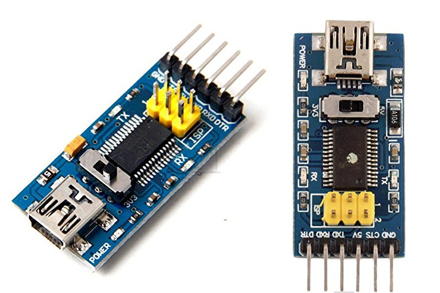
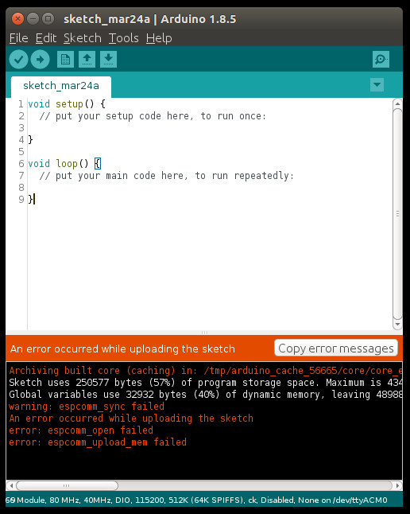

# 14.2 Wifi - ESP8266


## Option 1: Use ESP8266 With Arduino UNO R3

As in [**14.1 Serial**](../../Part5_Communication/14_Communication/01_serial.md), an **ESP8266** Wifi module has been connected to the virtual serial pin 10 and pin 11 on Arduino UNO. In this section, we'll talk about how to use this **ESP8266** Wifi module a bit more.

**<span style="color:red">Note</span>**: A lot of pictures in this section are directly cited from [https://www.geekstips.com/esp8266-arduino-tutorial-iot-code-example/](https://www.geekstips.com/esp8266-arduino-tutorial-iot-code-example/).

An **ESP8266** wifi module is provided in our Arduino course on-site, which looks like:


And its pins are defined as:


## Hardware Wiring

We still use the same hardware wiring way as in [**14.1 Serial**](../../Part5_Communication/14_Communication/01_serial.md) to wire the Arduino UNO and ESP8266.


## Sketch
The same sketch in [**14.1 Serial**](../../Part5_Communication/14_Communication/01_serial.md) is also adopted here.


## Mobile APPs


## Option 2: Use ESP8266 without Arduino Board

It is also possible to run the sketch on the **ESP8266** program without using an **Arduino UNO board**, for **ESP8266** comes with a MCU inside the module itself.

* [http://www.arduinesp.com/](http://www.arduinesp.com/) detailedly explained how to do that step by step. Three cannonical examples are given on [http://www.arduinesp.com/examples](http://www.arduinesp.com/examples):
- [Blink](http://www.arduinesp.com/blink)
- [Wifiwebserver](http://www.arduinesp.com/wifiwebserver)
- [Thingspeak Temperature Sensor](http://www.arduinesp.com/thingspeak)
Students are encouraged to finish all examples after class.
* You can also refer to [https://www.geekstips.com/esp8266-arduino-tutorial-iot-code-example/](https://www.geekstips.com/esp8266-arduino-tutorial-iot-code-example/).

Both websites adopt Arduino IDE to implement/verify/compile the sketch, and flash/download the binary code onto an ESP8266 via Arduino UNO R3 board. Let's just see how it goes. 

**<span style="color:red">Note</span>**: <span style="color:red">You do need a FD232RS as a proxy/bridge, which looks as follows:</span>




### Preparation

In order to flash sketch onto **ESP8266** via an Arduino board, we need to follow the steps on 
[https://github.com/esp8266/Arduino](https://github.com/esp8266/Arduino).


### STEP 1 - Install Arduino Core for ESP8266
**<span style="color:red">Note</span>**: Make sure you enabled **python2**, instead of **python3**.
```
$ cd /opt/arduino/hardware
$ mkdir esp8266com
$ cd esp8266com
$ git clone https://github.com/esp8266/Arduino.git esp8266
$ cd esp8266/tool6s
$ python get.py
Platform: x86_64-pc-linux-gnu
Tool esptool-0.4.9-linux64.tar.gz already downloaded
Extracting dist/esptool-0.4.9-linux64.tar.gz
Renaming esptool-0.4.9-linux64 to esptool
Tool linux64-xtensa-lx106-elf-gb404fb9.tar.gz already downloaded
Extracting dist/linux64-xtensa-lx106-elf-gb404fb9.tar.gz
Tool mkspiffs-0.1.2-linux64.tar.gz already downloaded
Extracting dist/mkspiffs-0.1.2-linux64.tar.gz
Renaming mkspiffs-0.1.2-linux64 to mkspiffs
```


### STEP 2 - Add Additional Boards Manager URLs
Start **Arduino IDE**, then click **File->Preferences->Settings**, fill [http://arduino.esp8266.com/stable/package_esp8266com_index.json](http://arduino.esp8266.com/stable/package_esp8266com_index.json) into **Additional Boards Manager URLs**, as:


### STEP 3 - Board Manager
Then, restart **Arduino IDE**. Click **Tools->Board->Board Manager**, then we search **esp**, make sure **Arduino AVR Boards** and **esp8266** are installed. Please refer to the following image:


**Note**: Without the installed Arduino AVR Boards, you will possibly meet the following **ERROR** message:

**<span style="color:red">SPIFFS Not Supported on avr</span>**

What is **SPIFFS**? For short, it is **SPI Flash Filing System**. For details, please refer to [http://www.instructables.com/id/Using-ESP8266-SPIFFS/](http://www.instructables.com/id/Using-ESP8266-SPIFFS/).

Afterwards, we select **Tools->Board->Generic ESP8266 Module**. 


### STEP 4 - Sketch Upload ERROR
After we selected **Board: "Generic ESP8266 Module"**, we are now trying to upload (after verify/compile) any sketch (here, the default **EMPTY** sketch for testing) to **Arduino board** with **ESP8266** **<span style="color:blue">connected</span>**. You will see the following **ERROR** messages:
```
warning: espcomm_sync failed
error: espcomm_open failed
error: espcomm_upload_mem failed
SPIFFS Upload failed!
```



By clicking **Tools->ESP8266 Sketch Data Upload**, you will see the following dialog:


By clicking **Yes**, the same **ERROR** messages will be given as:
```
[SPIFFS] data   : /tmp/untitled321754874.tmp/sketch_mar24a/data
[SPIFFS] size   : 64
[SPIFFS] page   : 256
[SPIFFS] block  : 4096
[SPIFFS] upload : /tmp/arduino_build_782393/sketch_mar24a.spiffs.bin
[SPIFFS] address: 0x6B000
[SPIFFS] reset  : ck
[SPIFFS] port   : /dev/ttyACM0
[SPIFFS] speed  : 115200

warning: espcomm_sync failed
error: espcomm_open failed
error: espcomm_upload_mem failed
SPIFFS Upload failed!
```


So, it seems we failed to flash our **ESP8266** Wifi module. But, we have to do something. This website [https://www.forward.com.au/pfod/ESP8266/GPIOpins/index.html](https://www.forward.com.au/pfod/ESP8266/GPIOpins/index.html) is just to solve this problem.


### STEP 5 - Flash ESP8266

In fact, 4 different methods have been summarized in [https://www.diyhobi.com/flash-program-esp-01-using-usb-serial-adapter/](https://www.diyhobi.com/flash-program-esp-01-using-usb-serial-adapter/) to fulfill the task how to flash **ESP8266**.


* Flash Mode: “DIO”
* Flash Frequency: “40MHz”
* CPU Frequency: “80 MHz”
* Flash Size: “1M (64K SPIFFS)”
* Debug Port: “Disabled”
* Debug Level: “None”
* Reset Method: “ck”
* Upload Speed: “115200”


## Option 3: Official Arduino Wifi Shield

You can also purchase an **Arduino Wifi Shield** recommended by official Arduino website(s), and accomplish Wifi communication. Please refer to the following official Arduino webpages:
* [https://store.arduino.cc/usa/arduino-wifi-shield](https://store.arduino.cc/usa/arduino-wifi-shield)
* [https://www.arduino.cc/en/Guide/ArduinoWiFiShield](https://www.arduino.cc/en/Guide/ArduinoWiFiShield)
* [https://www.arduino.cc/en/Tutorial/WiFiWebServer](https://www.arduino.cc/en/Tutorial/WiFiWebServer)
* [https://www.arduino.cc/en/Reference/WiFi](https://www.arduino.cc/en/Reference/WiFi)

