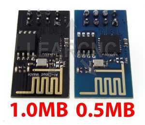
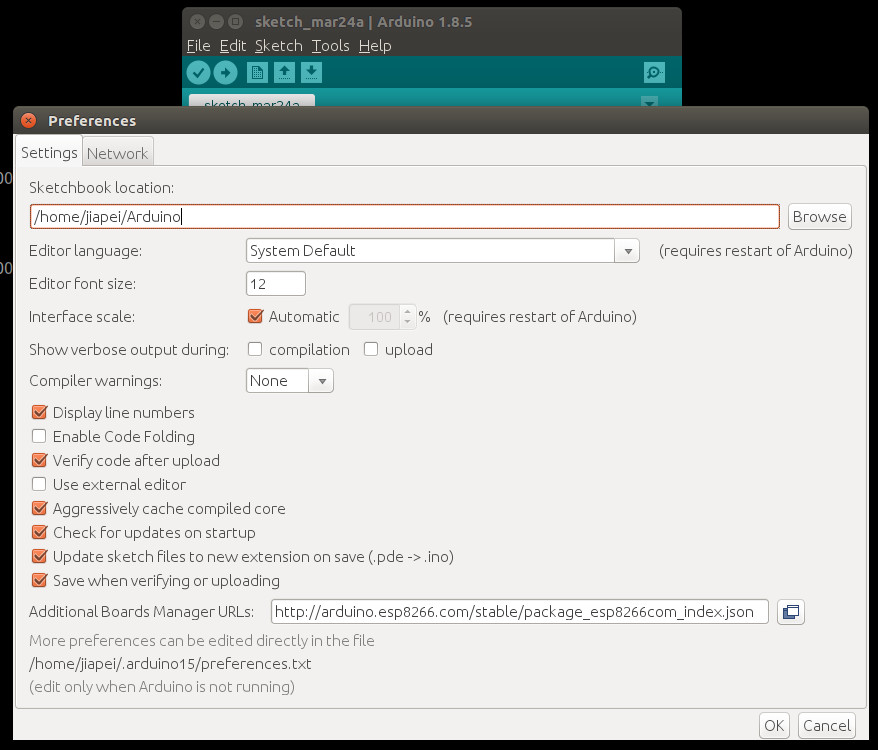
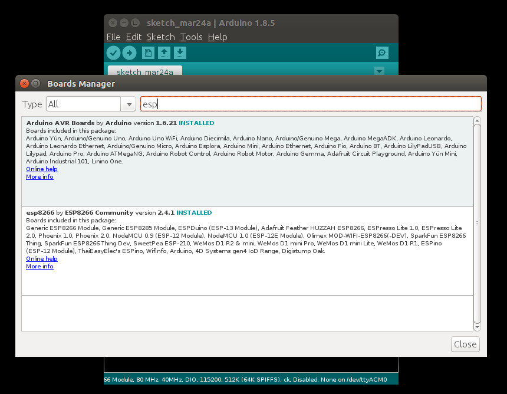
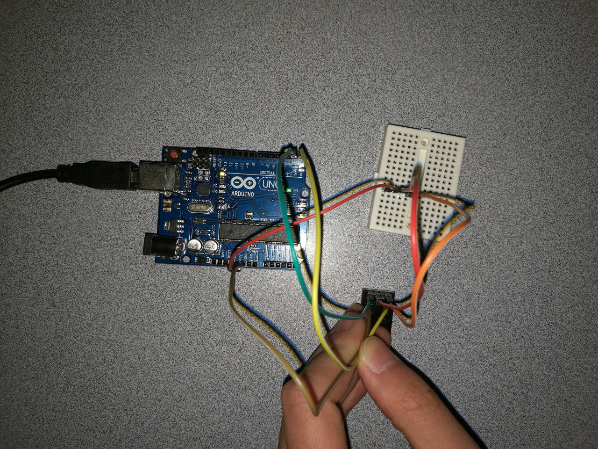

# 14.2 Wifi - ESP8266


## Option 1: ESP8266

An **ESP8266** wifi module is provided in our Arduino course on-site, which looks like:




## Preparation

In order to make **ESP8266** module runnable on an Arduino board, we need to follow the steps on 
[https://github.com/esp8266/Arduino](https://github.com/esp8266/Arduino).


### STEP 1 - Install Arduino Core for ESP8266
**Note**: Make sure you enabled **python2**, instead of **python3**.
```
$ cd /opt/arduino/hardware
$ mkdir esp8266com
$ cd esp8266com
$ git clone https://github.com/esp8266/Arduino.git esp8266
$ cd esp8266/tool6s
$ python get.py
Platform: x86_64-pc-linux-gnu
Tool esptool-0.4.9-linux64.tar.gz already downloaded
Extracting dist/esptool-0.4.9-linux64.tar.gz
Renaming esptool-0.4.9-linux64 to esptool
Tool linux64-xtensa-lx106-elf-gb404fb9.tar.gz already downloaded
Extracting dist/linux64-xtensa-lx106-elf-gb404fb9.tar.gz
Tool mkspiffs-0.1.2-linux64.tar.gz already downloaded
Extracting dist/mkspiffs-0.1.2-linux64.tar.gz
Renaming mkspiffs-0.1.2-linux64 to mkspiffs
```


### STEP 2 - Board Manager
Start **Arduino IDE**, then click **File->Preferences**, fill [http://arduino.esp8266.com/stable/package_esp8266com_index.json](http://arduino.esp8266.com/stable/package_esp8266com_index.json) into **Additional Boards Manager URLs**, as:



Then, restart **Arduino IDE**. Click **Tools->Board->Board Manager**, then we search **esp**, make sure **Arduino AVR Boards** and **esp8266** are installed. Please refer to the following image:



Without the installed Arduino AVR Boards, you will possibly meet the following **ERROR** message:

**<span style="color:red">SPIFFS Not Supported on avr</span>**

Afterwards, make sure **Tools->Board->Generic ESP8266 Module** is selected. 


### STEP 3 - Sketch Upload ERROR
After we make sure **Board: "Generic ESP8266 Module"** is selected, we are now trying to upload a sketch to Arduino board with **ESP8266** 
```
warning: espcomm_sync failed
error: espcomm_open failed
error: espcomm_upload_mem failed
SPIFFS Upload failed!
```


## Hardware Wiring


The way how we wire the circuit is just as in [geekstips](https://www.geekstips.com/wp-content/uploads/2016/12/ESP8266-WiFi-ESP-01-aansluiten-via-Arduino.jpg).

## Sketch
The code can be found at [Examples_Arduino - adafruit - _002_Wifi_ESP8266 - _002_Wifi_ESP8266.ino](https://github.com/LongerVisionRobot/Examples_Arduino/blob/master/howtomechatronics/_002_Wifi_ESP8266/_002_Wifi_ESP8266.ino).
You can also refer to [https://www.geekstips.com/esp8266-arduino-tutorial-iot-code-example/](https://www.geekstips.com/esp8266-arduino-tutorial-iot-code-example/).


## Using ESP8266 without Arduino Board

It is also possible run the sketch on the **ESP8266** program without using an **Arduino UNO board**, which has been detailedly explained on this website [http://www.arduinesp.com/](http://www.arduinesp.com/). Three cannonical examples are given on [http://www.arduinesp.com/examples](http://www.arduinesp.com/examples):
* [Blink](http://www.arduinesp.com/blink)
* [Wifiwebserver](http://www.arduinesp.com/wifiwebserver)
* [Thingspeak Temperature Sensor](http://www.arduinesp.com/thingspeak)
Students are encouraged to finish all examples after class.


## Option 2: Official Arduino Wifi Shield

You can also purchase an **Arduino Wifi Shield** recommended by official Arduino website(s), and accomplish Wifi communication. Please refer to the following official Arduino webpages:
* [https://store.arduino.cc/usa/arduino-wifi-shield](https://store.arduino.cc/usa/arduino-wifi-shield)
* [https://www.arduino.cc/en/Guide/ArduinoWiFiShield](https://www.arduino.cc/en/Guide/ArduinoWiFiShield)
* [https://www.arduino.cc/en/Tutorial/WiFiWebServer](https://www.arduino.cc/en/Tutorial/WiFiWebServer)
* [https://www.arduino.cc/en/Reference/WiFi](https://www.arduino.cc/en/Reference/WiFi)

