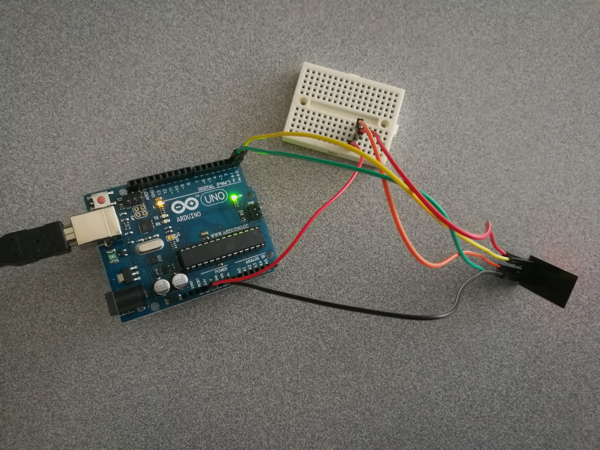

# 14.2 Wifi - ESP8266


## Option 1: ESP8266

An **ESP8266** wifi module is provided in our Arduino course on-site, which looks like:

 

## Hardware Wiring


The way how we wire the circuit is just as in [geekstips](https://www.geekstips.com/wp-content/uploads/2016/12/ESP8266-WiFi-ESP-01-aansluiten-via-Arduino.jpg).


## Preparation

In order to make **ESP8266** module runnable on an Arduino board, we need to follow the steps on 
[https://github.com/esp8266/Arduino](https://github.com/esp8266/Arduino).

### STEP 1 - Install Arduino Core for ESP8266
**Note**: Make sure you enabled **python2**, instead of **python3**.
```
$ cd /opt/arduino/hardware
$ mkdir esp8266com
$ cd esp8266com
$ git clone https://github.com/esp8266/Arduino.git esp8266
$ cd esp8266/tool6s
$ python get.py
Platform: x86_64-pc-linux-gnu
Tool esptool-0.4.9-linux64.tar.gz already downloaded
Extracting dist/esptool-0.4.9-linux64.tar.gz
Renaming esptool-0.4.9-linux64 to esptool
Tool linux64-xtensa-lx106-elf-gb404fb9.tar.gz already downloaded
Extracting dist/linux64-xtensa-lx106-elf-gb404fb9.tar.gz
Tool mkspiffs-0.1.2-linux64.tar.gz already downloaded
Extracting dist/mkspiffs-0.1.2-linux64.tar.gz
Renaming mkspiffs-0.1.2-linux64 to mkspiffs
```
Then, restart **Arduino IDE**. Click **Tools->Board->Board Manager**, then we need to install Arduino AVR Boards, please refer to 


## Sketch
The code can be found at [Examples_Arduino - adafruit - _002_Wifi_ESP8266 - _002_Wifi_ESP8266.ino](https://github.com/LongerVisionRobot/Examples_Arduino/blob/master/howtomechatronics/_002_Wifi_ESP8266/_002_Wifi_ESP8266.ino).
You can also refer to [https://www.geekstips.com/esp8266-arduino-tutorial-iot-code-example/](https://www.geekstips.com/esp8266-arduino-tutorial-iot-code-example/).


```
SPIFFS Not Supported on avr
```

```
warning: espcomm_sync failed
error: espcomm_open failed
error: espcomm_upload_mem failed
```


## Option 2: Official Arduino Wifi Shield

You can also purchase an **Arduino Wifi Shield** recommended by official Arduino website(s), and accomplish Wifi communication. Please refer to the following official Arduino webpages:
* [https://store.arduino.cc/usa/arduino-wifi-shield](https://store.arduino.cc/usa/arduino-wifi-shield)
* [https://www.arduino.cc/en/Guide/ArduinoWiFiShield](https://www.arduino.cc/en/Guide/ArduinoWiFiShield)
* [https://www.arduino.cc/en/Tutorial/WiFiWebServer](https://www.arduino.cc/en/Tutorial/WiFiWebServer)
* [https://www.arduino.cc/en/Reference/WiFi](https://www.arduino.cc/en/Reference/WiFi)

