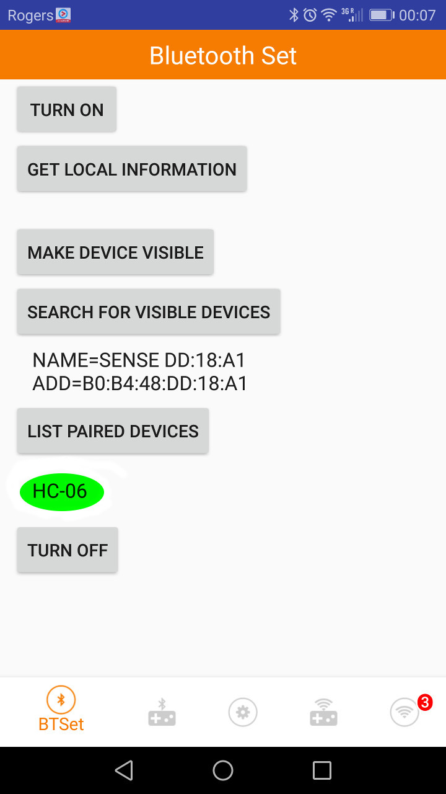

# 14.3 Bluetooth

A **ZS-040** (detected as **HC-0X**)  bluetooth module is provided in our Arduino course on-site, which looks like:

 

The **ONLY** difference is that the provided bluetooth module has 4 pins but **NOT** 6 pins, without pin **STATE** and pin **EN**.


## Hardware Wiring


## Sketch
The code can be found at [Examples_Arduino - arduinocc - _003_Bluetooth - _003_Bluetooth.ino](https://github.com/LongerVisionRobot/Examples_Arduino/blob/master/howtomechatronics/_003_Bluetooth/_003_Bluetooth.ino)
You can also refer to Adafruit's official website at [https://howtomechatronics.com/tutorials/arduino/arduino-and-hc-05-bluetooth-module-tutorial/](https://howtomechatronics.com/tutorials/arduino/arduino-and-hc-05-bluetooth-module-tutorial/).
```
#define ledPin 7
int state = 0;
void setup() {
  pinMode(ledPin, OUTPUT);
  digitalWrite(ledPin, LOW);
  Serial.begin(38400); // Default communication rate of the Bluetooth module
}
void loop() {
  if(Serial.available() > 0){ // Checks whether data is comming from the serial port
    state = Serial.read(); // Reads the data from the serial port
 }
 if (state == '0') {
  digitalWrite(ledPin, LOW); // Turn LED OFF
  Serial.println("LED: OFF"); // Send back, to the phone, the String "LED: ON"
  state = 0;
 }
 else if (state == '1') {
  digitalWrite(ledPin, HIGH);
  Serial.println("LED: ON");
  state = 0;
 } 
}
```

<span style="color:red">**Note: Please remove your bluetooth module before flashing your code onto Arduino board. Otherwise, you'll obtain the following ERROR messages:**</span>


## Mobile APPs

### Arduino Bluetooth Tutorial Example Android App

This APP can be downloaded from [https://howtomechatronics.com/download/arduino-bluetooth-tutorial-example-android-app/?wpdmdl=2833](https://howtomechatronics.com/download/arduino-bluetooth-tutorial-example-android-app/?wpdmdl=2833)


After the installation, by click on **Connect** on the **FIRST** page of this APP, you'll see all detected bluetooth devices as:


By selecting one of the devices, you'll see the device is NOW **connected**.


### <span style="color:blue">Longer Vision Robot LVControl</span>

[Longer Vision Robot](http://www.longervisionrobot.com) provides its own APP **LVContrl**, which can be downloaded from ...





## Assignment:

Two other very similar reference examples can be found at:
* [https://create.arduino.cc/projecthub/user206876468/arduino-bluetooth-basic-tutorial-d8b737](https://create.arduino.cc/projecthub/user206876468/arduino-bluetooth-basic-tutorial-d8b737)
* [http://www.martyncurrey.com/arduino-with-hc-05-bluetooth-module-at-mode/](http://www.martyncurrey.com/arduino-with-hc-05-bluetooth-module-at-mode/)

， which are left for students as their assignments.

