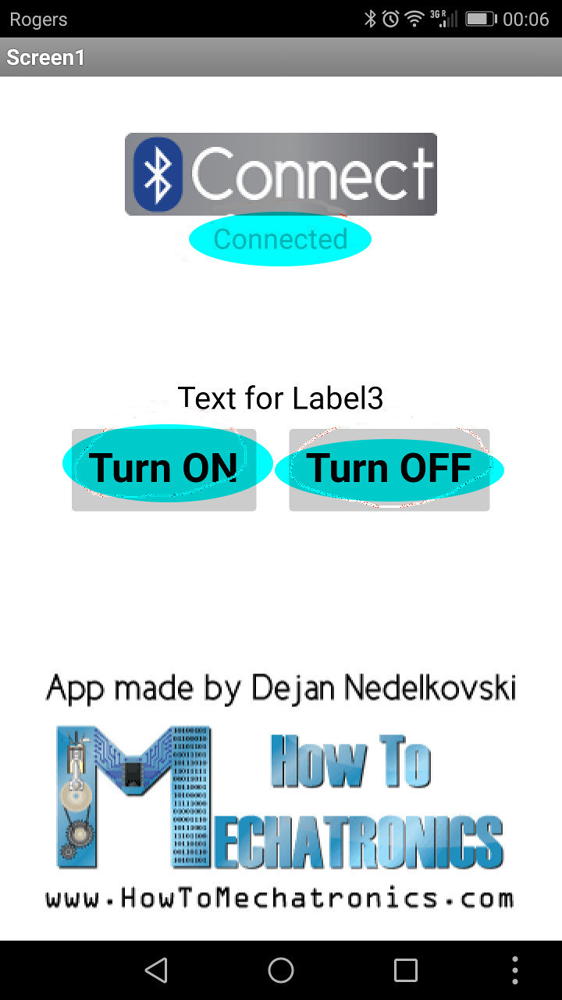

# 14.3 Bluetooth

A **ZS-040** (detected as **HC-0X**)  bluetooth module is provided in our Arduino course on-site, which looks like:

 

The **ONLY** difference is that the provided bluetooth module has 4 pins but **NOT** 6 pins, without pin **STATE** and pin **EN**.


## Hardware Wiring


## Sketch
The code can be found at [Examples_Arduino - arduinocc - _003_Bluetooth - _003_Bluetooth.ino](https://github.com/LongerVisionRobot/Examples_Arduino/blob/master/howtomechatronics/_003_Bluetooth/_003_Bluetooth.ino)
You can also refer to Adafruit's official website at [https://howtomechatronics.com/tutorials/arduino/arduino-and-hc-05-bluetooth-module-tutorial/](https://howtomechatronics.com/tutorials/arduino/arduino-and-hc-05-bluetooth-module-tutorial/).
```
#include <SoftwareSerial.h>
#define ledPin 7

SoftwareSerial mySerial(10, 11); // RX, TX
int state = 0;

void setup() {
  pinMode(ledPin, OUTPUT);
  digitalWrite(ledPin, HIGH);
  Serial.begin(38400); // Default communication rate of the Bluetooth module
  while (!Serial) {
    ; // wait for serial port to connect. Needed for native USB port only
  }

  Serial.println("Goodnight moon!");

  // set the data rate for the SoftwareSerial port
  mySerial.begin(9600);
  //mySerial.println("Hello, world?");
}

void loop() {   
  if(mySerial.available() > 0){ // Checks whether data is coming from the serial port
    state = mySerial.read(); // Reads the data from the serial port
    Serial.print("mySerial available!\n");
 }

 if (state == '0') {
  digitalWrite(ledPin, LOW); // Turn LED OFF
  Serial.println("LED: OFF"); // Send back, to the phone, the String "LED: ON"
  state = 0;
 }
 else if (state == '1') {
  digitalWrite(ledPin, HIGH);
  Serial.println("LED: ON");;
  state = 0;
 } 
}
```

<span style="color:red">**Note: Please remove your bluetooth module before flashing your code onto Arduino board. Otherwise, you'll obtain the following ERROR messages:**</span>


## Mobile APPs

### Arduino Bluetooth Tutorial Example Android App

This APP can be downloaded from [https://howtomechatronics.com/download/arduino-bluetooth-tutorial-example-android-app/?wpdmdl=2833](https://howtomechatronics.com/download/arduino-bluetooth-tutorial-example-android-app/?wpdmdl=2833)


After the installation, by click on **Connect** on the **FIRST** page of this APP, you'll see all detected bluetooth devices as:


By selecting one of the devices, you'll see the device is NOW **connected**.



By clicking **Turn ON** and **Turn OFF**, you will see the led can be light on and off accordingly.


And, some serial message will be printed on the **Monitor Serial** dialog as:


### <span style="color:blue">Longer Vision Robot LVControl</span>

[Longer Vision Robot](http://www.longervisionrobot.com) provides its own APP **LVContrl**, which can be downloaded from ...


The first page of **LVContrl** looks like:


By selecting page **BTSet**, we can easily **SEARCH FOR VISIBLE DEVICES**:


After simply pair the device by just clicking on the listed device name, you will be able to see that our bluetooth device is now listed in **LIST PAIRED DEVICES**.


## Assignment:

Two other very similar reference examples can be found at:
* [https://create.arduino.cc/projecthub/user206876468/arduino-bluetooth-basic-tutorial-d8b737](https://create.arduino.cc/projecthub/user206876468/arduino-bluetooth-basic-tutorial-d8b737)
* [http://www.martyncurrey.com/arduino-with-hc-05-bluetooth-module-at-mode/](http://www.martyncurrey.com/arduino-with-hc-05-bluetooth-module-at-mode/)

， which are left for students as their assignments.

