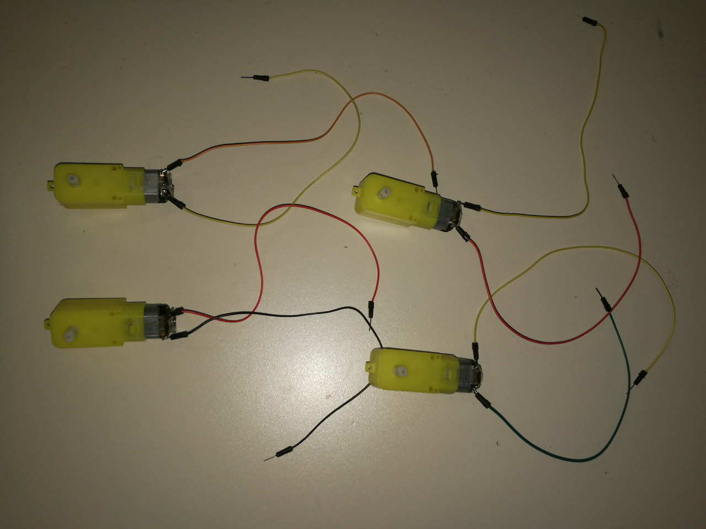
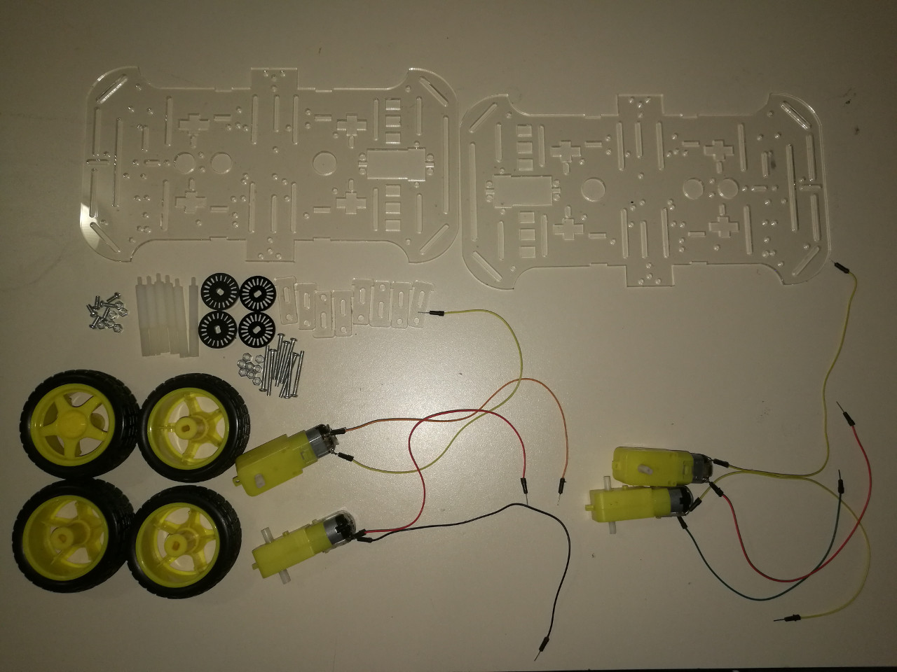
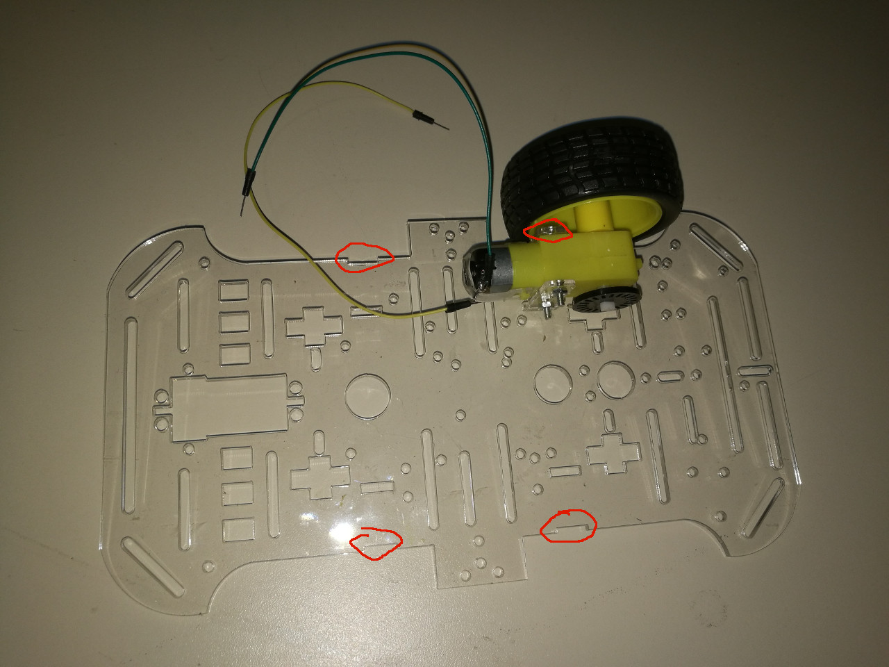
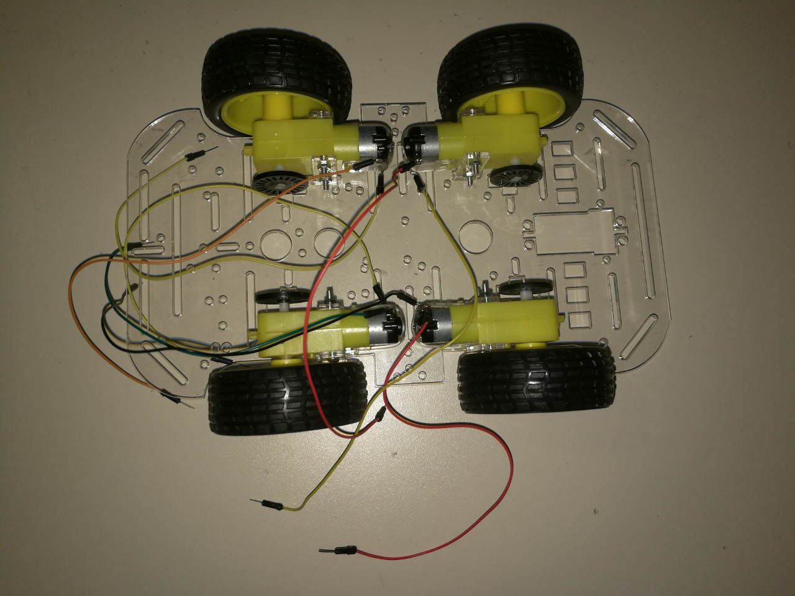
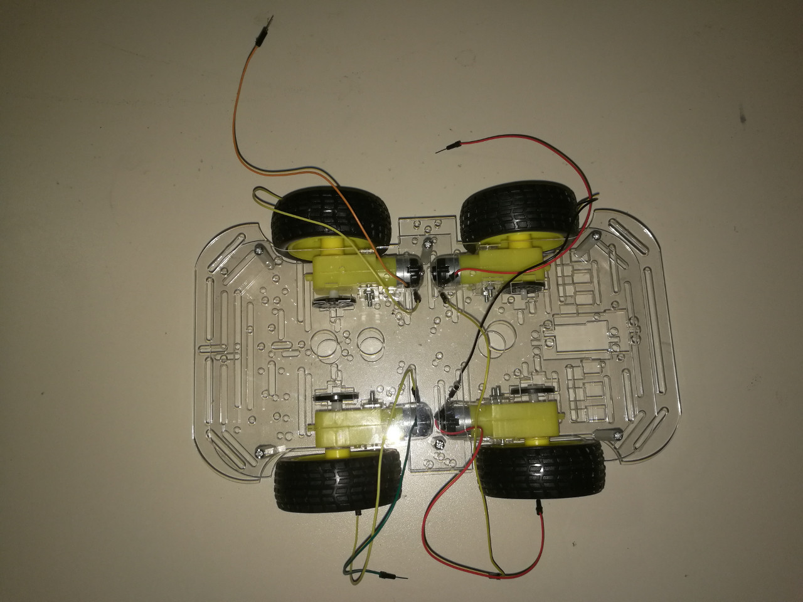

# 15.1 4-Wheel Driven Using 4 DC Motors

As shown in [**Chapter 12.1 - DC Motor**](../../Part3_Motors/12_Motors/01_dcmotor.md), one DC motor has been successfully driven by a very simple sketch.

Our very first step is to manually install these 4 wheels onto the vehicle chassis.

## Step 1: Solder 4 DC Motors

In fact, student who come to take our courses on-site will be given 4 already-soldered DC motors, as follows:

## Step 2: Assemble 4 DC Motors and 4 Speed Encoders onto 4 Wheels on Vehicle Chassis

We first list all chassis components as follows:

Then, we installed the **FIRST** wheel as follows:

It's quite clear that on any of the Acrylic plate, namely, the vehicle chassis, there are 4 indents (as shown in the above image), which are just for stablizing the DC motors by 2 peices of small Acrylic plugin boards.

After installing 4 DC motors and 4 speed encoders, the vehicle looks like:

## Step 3: Assemble Top Acrylic Plate With 6 Nylon Columns

With 6 Nylon columns (pillars), the top Acrylic board can be fixed as follows:

