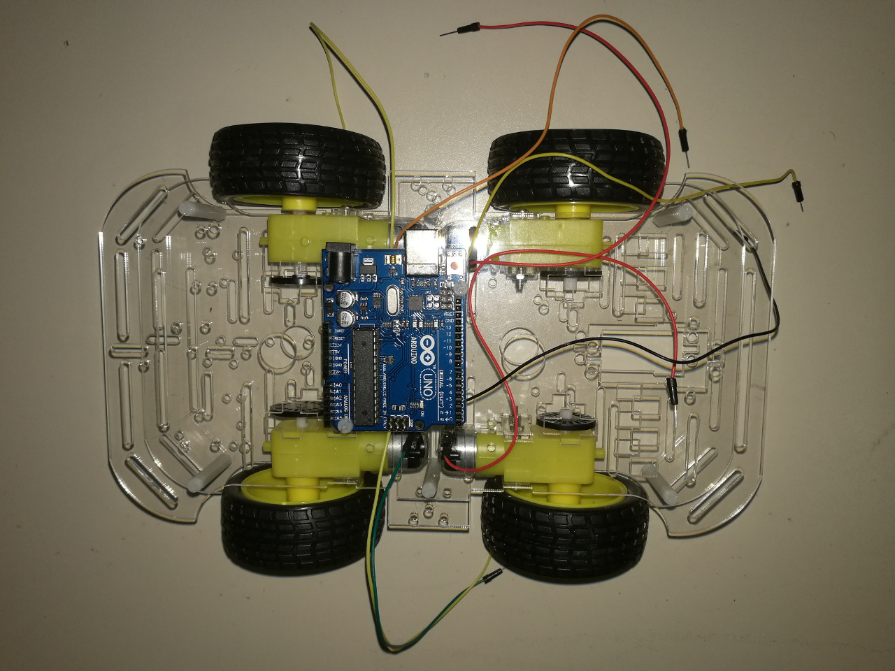
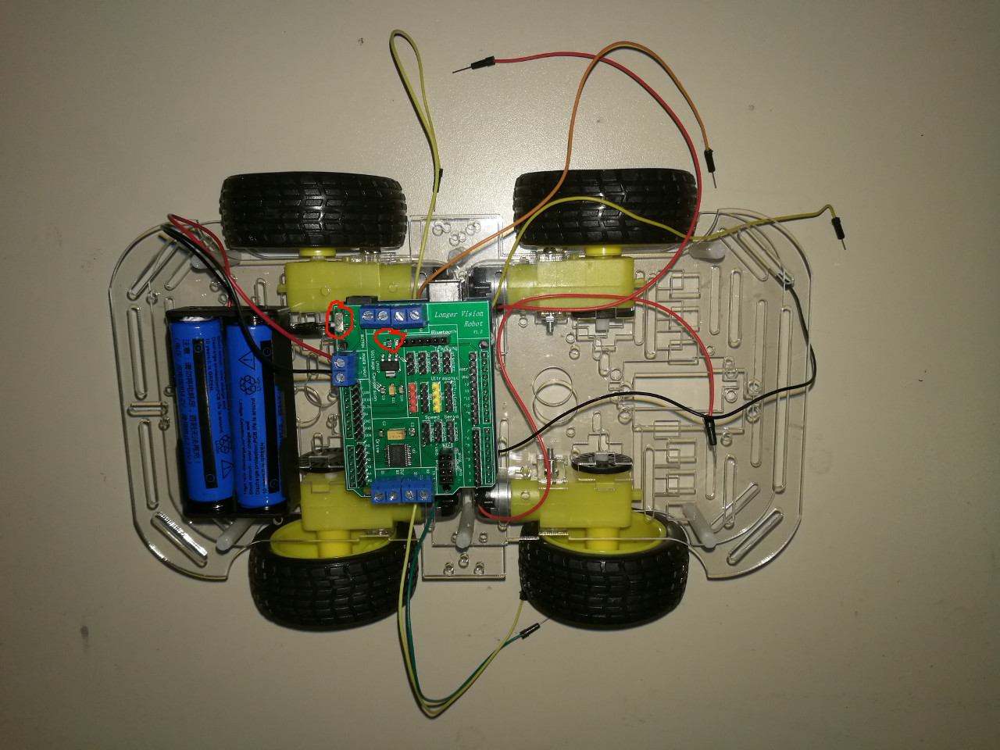
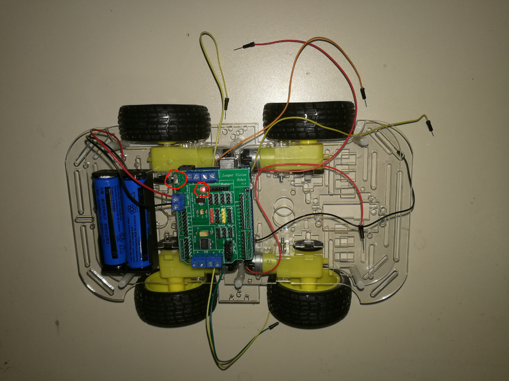

# 15.2 Arduino UNO and Longer Vision Robot Arduino Extension Board


## Step 1: Arduino UNO R3

Find a suitable place and fix Arduino UNO R3 onto the top Acrylic plate:




## Step 2:  Arduino Extension Board

Just directly plugin Longer Vision Robot Arduino Extension Board onto the Arduino UNO R3:




## Step 3: Batteries

And then, find a suitable place on the top Acrylic plate and fix the given black battery box, and put two batteries into the box. And it's NOT hard to connect two battery cables onto Arduino Extension Board's power:
* **<span style="color:red">red cable</span>**: power +
* **<span style="color:black">black cable</span>**: power -, namely, ground.

You now can simply test if the battery and power button on Arduino Extension Board is properly first:



As we can see, the battery and the power switch on Arduino Extension Board works fine.


## Step 4: Test 4 Wheels

We now connect Arduino UNO R3 on the vehicle to our laptop, and download the following sketch onto Arduino UNO. 

### Sketch
The code can be found at [Examples_Arduino - lvrobot - vehicle - racecar - _001_Drive4Wheels - _001_Drive4Wheels.ino](https://github.com/LongerVisionRobot/Examples_Arduino/blob/master/lvrobot/vehicle/racecar/_001_Drive4Wheels/_001_Drive4Wheels.ino)

```
int rightMotor1 = 17;
int rightMotor2 = 18;
int leftMotor1 = 13;
int leftMotor2 = 14;

int leftPWM = 5;
int rightPWM = 6;

void setup() {
  // put your setup code here, to run once:
  pinMode(leftMotor1, OUTPUT);
  pinMode(leftMotor2, OUTPUT);
  pinMode(rightMotor1, OUTPUT);
  pinMode(rightMotor2, OUTPUT);
  pinMode(leftPWM, OUTPUT);
  pinMode(rightPWM, OUTPUT);
}

void loop() {
  // put your main code here, to run repeatedly:
  analogWrite(leftPWM, 250);  // Set PWM output, namely, setup speed
  analogWrite(rightPWM, 250);

  digitalWrite(leftMotor1, HIGH);
  digitalWrite(leftMotor2, HIGH);
  digitalWrite(rightMotor1, HIGH);
  digitalWrite(rightMotor2, HIGH);

}
```

Make sure the motor pins are correctly designated, and make sure when the motors are set to **LOW**, all 4 wheels are slowed down, and when the motors are set to **HIGH**, all 4 wheels will turn to the **SAME** direction.