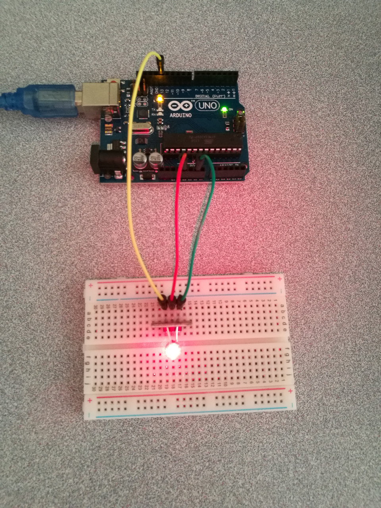

# Laser Emitter

## Hardware Wiring


## Sketch
### Emit
```
void setup()
{
  pinMode(13, OUTPUT); // 定义13脚为数字输出接口
}
void loop() {
  digitalWrite(13, HIGH); // 打开激光头
  delay(1000);
  // Delay 1 second
  digitalWrite(13, LOW); // 关闭激光头
  delay(1000);
  // Delay 1 second
}
```