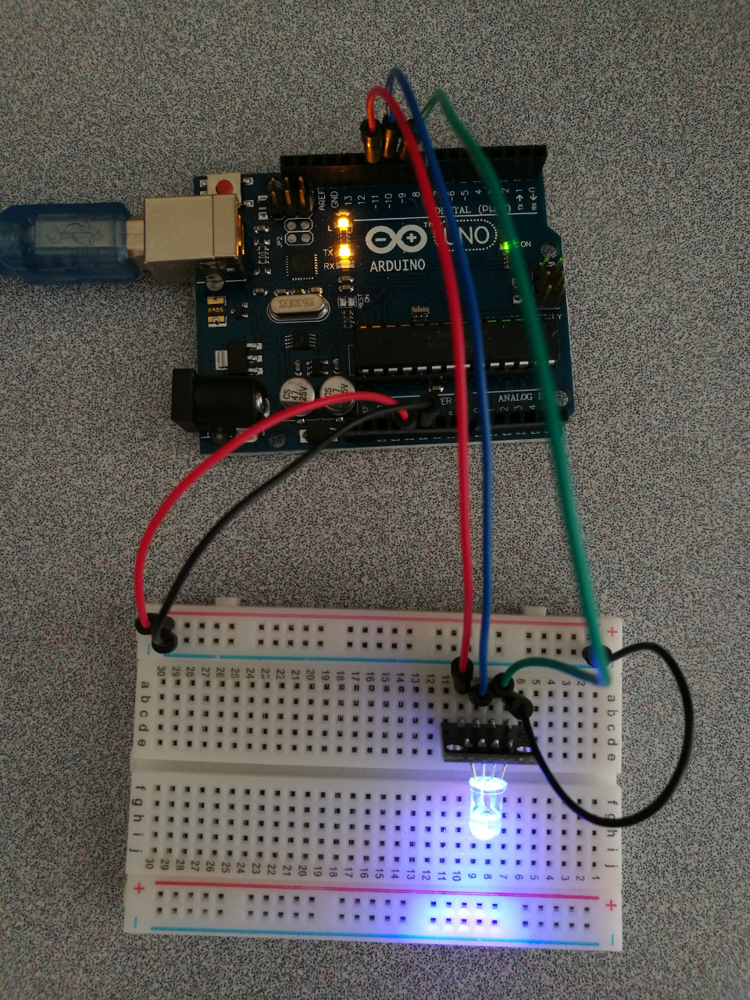

# Temperature and Humidity Sensor

## Hardware Wiring


## Sketch
### Emit
```
int redpin = 11; //select the pin for the red LED
int bluepin =10; // select the pin for the  blue LED
int greenpin =9;// select the pin for the green LED

int val;

void setup() {
  pinMode(redpin, OUTPUT);
  pinMode(bluepin, OUTPUT);
  pinMode(greenpin, OUTPUT);
  Serial.begin(9600);
}

void loop() 
{
  for(val=255; val>0; val--)
  {
    analogWrite(11, val);
    analogWrite(10, 255-val);
    analogWrite(9, 128-val);
    delay(1); 
  }
  for(val=0; val<255; val++)
  {
    analogWrite(11, val);
    analogWrite(10, 255-val);
    analogWrite(9, 128-val);
    delay(1); 
  }
  Serial.println(val, DEC);
}
```