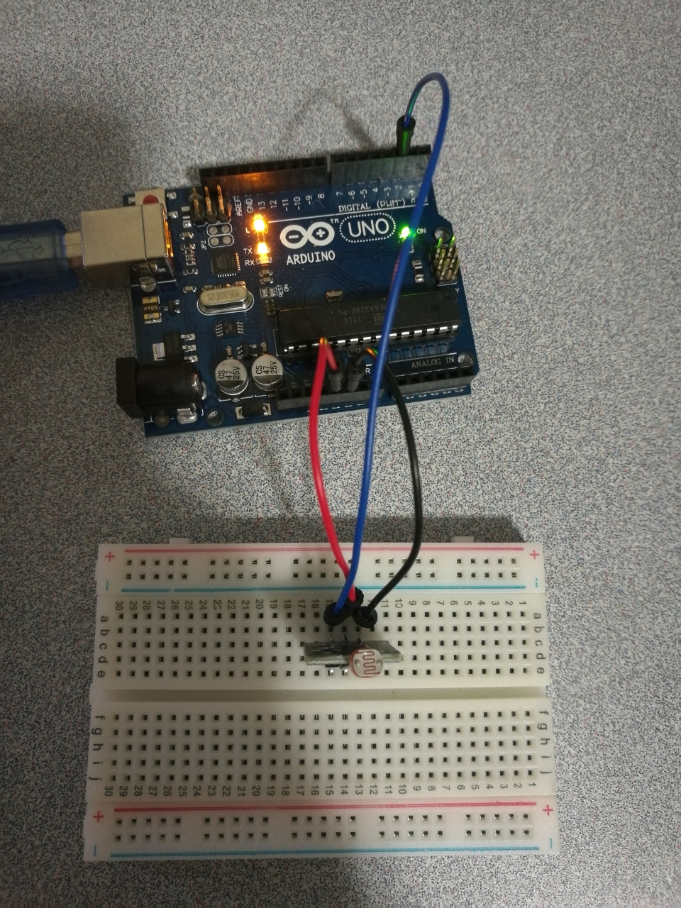

# Photoresistor

## Hardware Wiring


## Sketch
### Emit
```
int sensorPin = 2;
int value = 0;
void setup() {
  pinMode(sensorPin, INPUT);
  Serial.begin(9600);
}
void loop() {
  value = analogRead(sensorPin);
  Serial.println(value, DEC);
  delay(50);
}
```