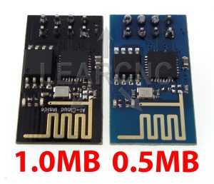

# 14.2 Wifi - ESP8266

An **ESP8266** wifi module is provided in our Arduino course on-site, which looks like:

 

## Hardware Wiring


```
SPIFFS Not Supported on avr
```

```
warning: espcomm_sync failed
error: espcomm_open failed
error: espcomm_upload_mem failed
```


## Sketch
The code can be found at [Examples_Arduino - adafruit - _002_Wifi_ESP8266 - _002_Wifi_ESP8266.ino](https://github.com/LongerVisionRobot/Examples_Arduino/blob/master/howtomechatronics/_002_Wifi_ESP8266/_002_Wifi_ESP8266.ino).
You can also refer to [https://www.geekstips.com/esp8266-arduino-tutorial-iot-code-example/](https://www.geekstips.com/esp8266-arduino-tutorial-iot-code-example/).
```

```


## Assignment: Arduino Wifi Shield

You can also purchase an **Arduino Wifi Shield** recommended by official Arduino website(s), and accomplish Wifi communication. Please refer to the following official Arduino webpages:
* [https://store.arduino.cc/usa/arduino-wifi-shield](https://store.arduino.cc/usa/arduino-wifi-shield)
* [https://www.arduino.cc/en/Guide/ArduinoWiFiShield](https://www.arduino.cc/en/Guide/ArduinoWiFiShield)
* [https://www.arduino.cc/en/Tutorial/WiFiWebServer](https://www.arduino.cc/en/Tutorial/WiFiWebServer)
* [https://www.arduino.cc/en/Reference/WiFi](https://www.arduino.cc/en/Reference/WiFi)

